# Apertus v2 tokenizer development record

Purpose: record how the Apertus v2 tokenizer candidates were developed. The decision axes are (i) distributional quality (enabling better downstream language modeling); (ii) **multilingual efficiency & fairness**; (iii) **production safety** (the tokenizer must not silently corrupt text or emit unknown tokens). This document holds the design-choice ablations, the downstream-LM evidence, the open-source reference comparison, the production-safety checks, and the data-side search that produced the four shipped `preliminary_*` candidates. The candidates themselves and the recommendation are in [REPORT_focus_candidates.md](REPORT_focus_candidates.md); the build recipes are in [TRAINING.md](TRAINING.md); the pretokenization and special-token design rationale is in [apertus_tokenizer_design.md](apertus_tokenizer_design.md).

**How to read:** ↑ = higher is better, ↓ = lower is better. **Bold** marks the best value in a column, except in the companion-LM delta tables, where it marks p_adj<0.05 (restated at each such table). Production-safety verdicts are **pass** (no issue) / **warn** (advisory, not disqualifying) / **fail** (disqualifying defect) / **n/a** (check doesn't apply, neutral). All evaluated tokenizers are GPT-2-style **byte-level**. Metric definitions, datasets, and the design matrix are in *Methods and metrics*. Two reference tokenizers fail the production-safety gate: Gemma 3 and EuroLLM (see *Production-safety gates*).

## Contents

- [How the search proceeded](#how-the-search-proceeded)
- [Design-choice ablations](#design-choice-ablations)
- [Additional ablations](#additional-ablations)
- [Candidate selection](#candidate-selection)
- [Candidates and references across FLORES sets](#candidates-and-references-across-flores-sets)
- [Missing evidence](#missing-evidence)
- [Terminology](#terminology)
- [Methods and metrics](#methods-and-metrics)
  - [Evaluation corpora](#evaluation-corpora)
  - [Metrics](#metrics)
  - [Tokenizer design matrix](#tokenizer-design-matrix)
- [Extrinsic (downstream LM) details](#extrinsic-downstream-lm-details)
- [Production-safety gates and round-trip fidelity](#production-safety-gates-and-round-trip-fidelity)
- Appendices: [full intrinsic tables](#appendix-full-intrinsic-tables-all-flores-sets), [per-language plots](#appendix-per-language-plots-compression--vocabulary-utilization), [family plots](#appendix-per-language-plots-by-pa-bpe-training-family), [vocabulary usage](#appendix-vocabulary-usage-active--rare--uncommon--unseen-and-scaffold), [long-token and junk-token examples](#appendix-long-token-64-char-examples)

## How the search proceeded

The search ran in three stages. One naming note first: "balanced" names two different corpora in these documents. The `balanced` tag on a tokenizer refers to the 10 GB tokenizer-training mixture (*Training-data compositions*, under Methods). The "balanced" budget in the extrinsic tables refers to the LM training mixture, which is the same for every standard downstream run (as opposed to the 20B math+code mixture). A "balanced" tag in a tokenizer name therefore always refers to its tokenizer-training corpus.

1. **Pretokenizer and algorithm ablations on the balanced mixture.** Plain BPE, Unigram LM, SuperBPE, and parity-aware BPE were trained on the balanced mixture across pretokenizer families (gpt2, gpt4o, claude, right-aligned digits, punctuation, whitespace, apertus, clean-multi), and a roughly 1B-parameter LM was trained for each. Decisions from this stage: BPE over Unigram LM (validation BPB 0.02 to 0.03 bits/byte lower), the clean-multi pretokenizer over apertus for code (MBPP 0.190 against 0.058 at matched settings; the apertus regex fuses newlines into multi-line tokens the model fails to reproduce), and NFC normalization kept (no measurable validation-BPB difference). The pretokenizer-family ordering on validation BPB is in the extrinsic trends under *Extrinsic (downstream LM) details*.
2. **Data and parity ablations on FineWeb2-full.** Tokenizer training moved from the balanced mixture to the quality-filtered FineWeb2-full corpus with parity-family grouping, which is far fairer multilingually (Gini 0.076 against 0.415 at a fixed gpt4 pretokenizer). This stage settled parity-aware BPE over plain BPE, hybrid-window over base parity, the `{1,16}` punctuation/whitespace caps, the `tuned` and then `consv2` parity configs, and the plus2/plus3 apostrophe extensions with the `repcap8` run cap; SuperBPE was evaluated against its PA-BPE base and not adopted.
3. **Candidate recipes.** With the design fixed, the remaining search was over per-family data quotas, the global-merge count, and the vocabulary size. It produced the four shipped `preliminary_*` candidates and is summarized in *Candidate selection*.

## Design-choice ablations

I recommend parity-aware BPE with the clean-multi pretokenizer, capping enabled, and hybrid-window. The design-choice comparisons below are the evidence, in summary:

- **Parity-aware vs plain BPE.** Parity-aware BPE has a lower Gini than plain BPE (0.081 against 0.114 at matched settings), at a small Eng B/tok cost (4.24 against 4.43).
- **PA-BPE vs SuperBPE.** The SuperBPE stage raises Eng B/tok by 18–25%, but it also raises Gini (0.081 to 0.106) and lowers vocab utilization (0.605 to 0.550); on the apertus base it lowers MBPP (0.058 to 0.004). The added tokens are used mostly for space-delimited languages and rarely for CJK, Indic, or Thai.
- **clean-multi vs apertus.** clean-multi has a higher operator-isolation (0.99 against 0.50, measured on prose; on code the gap is far smaller, about 0.11) and a higher MBPP (0.190 against 0.058); apertus has the lower multilingual FLORES BPB. The operator-isolation gap co-varies with the regex change rather than isolating a single cause; the mechanism shown directly is newline fusion (§ on code below).
- **Capped vs uncapped.** The capped regex produces fewer junk tokens (28 against 64) and has no dead-vocab warning, with no change to Eng B/tok or Val BPB.
- **Hybrid-window vs base parity.** Hybrid-window has a higher Eng B/tok (4.24 against 3.13) with no fairness gain for base parity.

Each ablation compares tokenizers that differ in one design choice, measured on the broad FLORES set. In each table, the columns most affected by that design choice are placed first, and a production-safety gate column is included only when its value differs across the tokenizers being compared. Where downstream-LM results exist, an *Extrinsic (downstream LM)* block follows the table. In that block, `[matched]` marks a tokenizer for which an LM was trained from scratch on that exact tokenizer (Val, FLORES, and code BPB at 10B balanced; MC-math and MBPP at 20B math+code), and `[proxy]` marks a sibling companion-LM run on a different tokenizer, which should be read as directional. `pending` means the run is mapped but the eval is not yet measured, and `-` means the eval was not run. The full per-tokenizer extrinsic table and the training setup are in *Extrinsic (downstream LM) details* below.

### Punctuation/whitespace capping (capped vs uncapped)

This ablation compares capping runs of punctuation, symbols, and whitespace at 16 characters during pretokenization against leaving them uncapped.

Tokenizers using the capped regex produce 28 junk tokens, against 64 for the uncapped regex, and 8 long (>64 char) tokens against 14. The uncapped tokenizer also has one pretokenizer-unreachable vocab token, which the gate reports as a warning. Eng B/tok (4.24 against 4.24) and Val BPB (0.729 against 0.728) are unchanged; the uncapped tokenizer has a slightly lower Gini (0.074 against 0.081). The candidates use the capped regex.

| Tokenizer | Junk toks (≥8) ↓ | Long toks (>64) | Vocab util ↑ | Vocab size | Eng comp (B/tok) ↑ | Multiling. sent/tok ↑ | Vocab-util CoV ↓ | Avg langs/token ↑ | Gini ↓ | CER ↓ | Boundary-cross ↓ | Operator-isol ↑ | Dead vocab ↓ | Byte-frag (benign) |
|---|---|---|---|---|---|---|---|---|---|---|---|---|---|---|
| CleanV1-pretok + PA-BPE (tuned data) | **28** | 8 | **0.605** | 127,835 | 4.238 | 0.0232 | 0.4138 | 2.79 | 0.081 | 0.00043 | 0.02198 | 0.987 | **0** | 5596 |
| PA-Clean-uncapped | 64 | 14 | 0.586 | 127,835 | **4.242** | 0.0232 | **0.3863** | **2.85** | **0.074** | 0.00043 | **0.02184** | 0.987 | 1 | 5691 |

*Faceted per-language vocabulary utilization, one pane per tokenizer:*

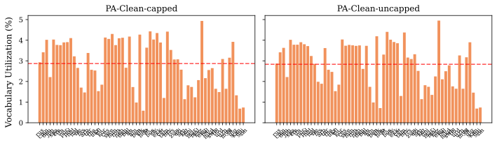

*Extrinsic (downstream LM):*
| Tokenizer | Val BPB ↓ | FLORES BPB (tr.) ↓ | Code BPB ↓ | MC-math ↑ | MBPP ↑ [95% CI] |
|---|---|---|---|---|---|
| CleanV1-pretok + PA-BPE (tuned data) [matched] | 0.729 | 1.169 | 0.533 | 0.295 | 0.190 [0.156, 0.226] |
| PA-Clean-uncapped [matched] | 0.728 | 1.167 | 0.529 | - | - |

### Parity-aware vs plain BPE

This ablation compares parity-aware BPE, which equalizes per-language encoding cost through its merge-selection rule, against plain frequency-driven BPE.

At matched capped settings, parity-aware BPE has a Gini of 0.081 against 0.114 for plain BPE, and a vocab-util CoV of 0.414 against 0.491. Multilingual compression is similar (sent/tok 0.0232 against 0.0228). Plain BPE has a higher Eng B/tok (4.43 against 4.24). On the 1B proxy, parity-aware BPE has a Val BPB 0.008 higher than plain BPE. The candidates use parity-aware BPE.

| Tokenizer | Gini ↓ | Vocab-util CoV ↓ | Multiling. sent/tok ↑ | Vocab size | Eng comp (B/tok) ↑ | Vocab util ↑ | Avg langs/token ↑ | CER ↓ | Boundary-cross ↓ | Operator-isol ↑ | Dead vocab ↓ | Byte-frag (benign) | Long toks (>64) | Junk toks (≥8) ↓ |
|---|---|---|---|---|---|---|---|---|---|---|---|---|---|---|
| CleanV1-pretok + PA-BPE (tuned data) | **0.081** | **0.4138** | **0.0232** | 127,835 | 4.238 | 0.605 | 2.79 | 0.00043 | **0.02198** | **0.987** | **0** | 5596 | 8 | **28** |
| BPE-Clean-capped | 0.114 | 0.4913 | 0.0228 | 128,000 | 4.428 | **0.615** | 2.83 | 0.00043 | 0.02860 | **0.987** | **0** | 2642 | 0 | 46 |
| BPE-Clean-uncapped | 0.375 | 0.6167 | 0.0140 | 128,004 | **4.559** | 0.535 | **2.98** | 0.00043 | 0.02832 | 0.986 | 3 | 1325 | 17 | 135 |

*Faceted per-language vocabulary utilization, one pane per tokenizer:*

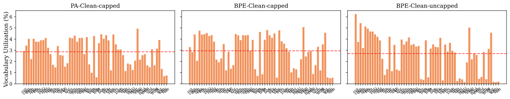

*Extrinsic (downstream LM):*
| Tokenizer | Val BPB ↓ | FLORES BPB (tr.) ↓ | Code BPB ↓ | MC-math ↑ | MBPP ↑ [95% CI] |
|---|---|---|---|---|---|
| CleanV1-pretok + PA-BPE (tuned data) [matched] | 0.729 | 1.169 | 0.533 | 0.295 | 0.190 [0.156, 0.226] |
| BPE-Clean-uncapped [matched] | 0.716 | 1.157 | 0.523 | 0.270 | 0.148 [0.118, 0.180] |

*[proxy] companion-LM 1B-balanced Δ, factor: Trainer (BPE vs PA-BPE)* (Δ = B−A; BPB Δ<0 means B better; **bold** = p_adj<0.05):
| A | B | ΔVal | ΔFLORES (tr.) | ΔFLORES (all) | ΔBLiMP | ΔCode |
|---|---|---|---|---|---|---|
| BPE clean | PA-BPE clean | +0.0076 | -- | -- | -- | -- |

### SuperBPE on the PA-BPE candidate base (does SuperBPE help, matched data)

This ablation tests whether adding a SuperBPE superword stage on top of the PA-BPE candidate base helps, on matched base and training data.

Adding the SuperBPE stage raises Eng B/tok by 18–25% (clean: 4.24 to 5.01; apertus: 4.34 to 5.40) and raises Gini (clean: 0.081 to 0.106; apertus: 0.081 to 0.110); vocab utilization drops from 0.605 to 0.550. On the apertus base, FLORES BPB rises from 2.943 to 3.081 and MBPP drops from 0.058 to 0.004. On the clean base the downstream BPB is close to the PA-BPE base (Val BPB 0.732 against 0.729, FLORES bits-per-byte trained 1.161 against 1.169) and MBPP is higher (0.196 against 0.190); the cost is multilingual fairness.

| Tokenizer | Eng comp (B/tok) ↑ | Multiling. sent/tok ↑ | Gini ↓ | Vocab size | Vocab util ↑ | Vocab-util CoV ↓ | Avg langs/token ↑ | CER ↓ | Boundary-cross ↓ | Operator-isol ↑ | Byte-alphabet missing ↓ | Per-script UNK | Byte-frag (benign) | Long toks (>64) | Junk toks (≥8) ↓ |
|---|---|---|---|---|---|---|---|---|---|---|---|---|---|---|---|
| Apertus-pretok + PA-BPE | 4.336 | **0.0233** | **0.081** | 127,835 | **0.606** | **0.4130** | 2.79 | 0.00043 | 0.02208 | 0.502 | **0** | pass | 5592 | 8 | **27** |
| Apertus-pretok + PA-BPE + SuperBPE | **5.402** | 0.0230 | 0.110 | 128,000 | 0.544 | 0.4992 | **3.14** | 0.00043 | 0.02686 | 0.466 | 15 | n/a | 3441 | 1 | 76 |
| CleanV1-pretok + PA-BPE (tuned data) | 4.238 | 0.0232 | **0.081** | 127,835 | 0.605 | 0.4138 | 2.79 | 0.00043 | **0.02198** | **0.987** | **0** | pass | 5596 | 8 | 28 |
| CleanV1-pretok + PA-BPE + SuperBPE | 5.013 | 0.0227 | 0.106 | 128,000 | 0.550 | 0.4892 | 3.02 | 0.00043 | 0.02629 | **0.987** | 15 | n/a | 3435 | 0 | 77 |

*Faceted per-language compression (sentences/token), one pane per tokenizer:*

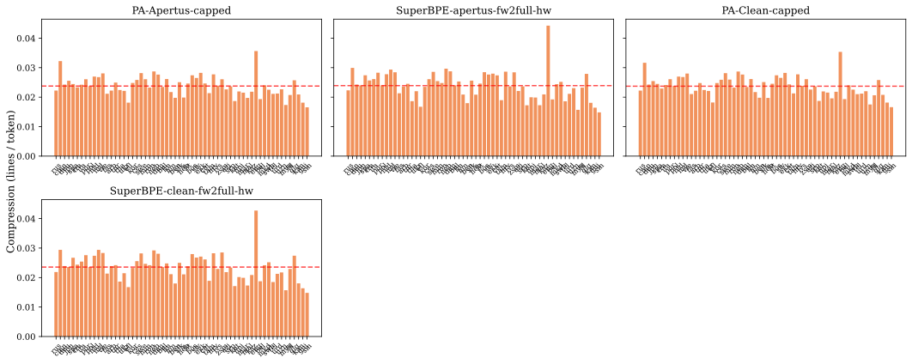

*Extrinsic (downstream LM):*
| Tokenizer | Val BPB ↓ | FLORES BPB (tr.) ↓ | Code BPB ↓ | MC-math ↑ | MBPP ↑ [95% CI] |
|---|---|---|---|---|---|
| Apertus-pretok + PA-BPE [matched] | 0.729 | 1.170 | 0.531 | 0.270 | 0.058 [0.038, 0.080] |
| Apertus-pretok + PA-BPE + SuperBPE [matched] | 0.733 | 1.176 | 0.541 | 0.269 | 0.004 [0.000, 0.010] |
| CleanV1-pretok + PA-BPE (tuned data) [matched] | 0.729 | 1.169 | 0.533 | 0.295 | 0.190 [0.156, 0.226] |
| CleanV1-pretok + PA-BPE + SuperBPE [matched] | 0.732 | 1.161 | 0.536 | 0.268 | 0.196 [0.162, 0.232] |

### Pretokenizer family (apertus vs clean-multi vs gpt4)

This ablation compares the three pretokenizer families (apertus, clean-multi, gpt4), which differ in digit grouping, apostrophe and contraction handling, and operator handling.

clean-multi and apertus are close on multilingual compression and Gini; they differ on code. apertus and gpt4 have an operator-isolation near 0.50 on prose (operators tokenized together with operands), against 0.99 for clean-multi; on code that gap narrows to about 0.11, so it is a prose measurement, not a direct code-corpus one. apertus has an MBPP of 0.058 against 0.190 for clean-multi (p_BH<0.001). gpt4 has 3 pretokenizer-unreachable vocab tokens, which the gate reports as a warning. The candidates use the clean-multi family; apertus has the lower multilingual FLORES BPB.

| Tokenizer | Operator-isol ↑ | Eng comp (B/tok) ↑ | Multiling. sent/tok ↑ | Vocab size | Vocab util ↑ | Vocab-util CoV ↓ | Avg langs/token ↑ | Gini ↓ | CER ↓ | Boundary-cross ↓ | Dead vocab ↓ | Byte-frag (benign) | Junk toks (≥8) ↓ |
|---|---|---|---|---|---|---|---|---|---|---|---|---|---|
| Apertus-pretok + PA-BPE | 0.502 | 4.336 | 0.0233 | 127,835 | **0.606** | 0.4130 | 2.79 | 0.081 | 0.00043 | 0.02208 | **0** | 5592 | **27** |
| CleanV1-pretok + PA-BPE (tuned data) | **0.987** | 4.238 | 0.0232 | 127,835 | 0.605 | 0.4138 | 2.79 | 0.081 | 0.00043 | **0.02198** | **0** | 5596 | 28 |
| PA-gpt4-fineweb2full | 0.505 | **4.433** | **0.0235** | 127,825 | 0.590 | **0.3755** | **2.93** | **0.076** | 0.00043 | 0.02226 | 3 | 5673 | 33 |

*Faceted per-language compression (sentences/token), one pane per tokenizer:*

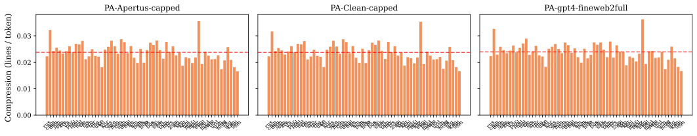

*Extrinsic (downstream LM):*
| Tokenizer | Val BPB ↓ | FLORES BPB (tr.) ↓ | Code BPB ↓ | MC-math ↑ | MBPP ↑ [95% CI] |
|---|---|---|---|---|---|
| Apertus-pretok + PA-BPE [matched] | 0.729 | 1.170 | 0.531 | 0.270 | 0.058 [0.038, 0.080] |
| CleanV1-pretok + PA-BPE (tuned data) [matched] | 0.729 | 1.169 | 0.533 | 0.295 | 0.190 [0.156, 0.226] |
| PA-gpt4-fineweb2full [matched] | 0.728 | 1.169 | 0.531 | - | - |

*[proxy] companion-LM 1B-balanced Δ, factor: Pretokenizer* (Δ = B−A; BPB Δ<0 means B better; **bold** = p_adj<0.05):
| A | B | ΔVal | ΔFLORES (tr.) | ΔFLORES (all) | ΔBLiMP | ΔCode |
|---|---|---|---|---|---|---|
| GPT-4o | Claude | **+0.0019** | +0.0001 | **+0.0035** | +0.0245 | +0.0001 |
| GPT-4o | Punct | **+0.0074** | +0.0038 | **+0.0087** | +0.0179 | +0.0089 |
| GPT-4o | RightAlign | **+0.0021** | **+0.0028** | **+0.0052** | +0.0176 | +0.0012 |
| GPT-4o | Whitespace | +0.0094 | **+0.0072** | **-0.0116** | +0.0066 | +0.0086 |
| GPT-4o | GPT-2 | +0.0014 | +0.0001 | +0.0018 | +0.0167 | -0.0029 |

### Hybrid-window vs base parity

This ablation compares the hybrid-window parity rule, which adds a global phase so the trainer does not keep selecting the same language, against the base lowest-cost rule.

Base parity gives an Eng B/tok of 3.13, against 4.24 for hybrid-window, with a lower sent/tok (0.0214 against 0.0232) and lower vocab utilization (0.527 against 0.605), and no lower Gini (0.087 against 0.081). On the 1B proxy, hybrid-window has a lower Val BPB and FLORES BPB. The candidates use hybrid-window.

| Tokenizer | Eng comp (B/tok) ↑ | Multiling. sent/tok ↑ | Gini ↓ | Vocab-util CoV ↓ | Vocab size | Vocab util ↑ | Avg langs/token ↑ | CER ↓ | Boundary-cross ↓ | Operator-isol ↑ | Byte-frag (benign) | Long toks (>64) | Junk toks (≥8) ↓ |
|---|---|---|---|---|---|---|---|---|---|---|---|---|---|
| CleanV1-pretok + PA-BPE (tuned data) | **4.238** | **0.0232** | **0.081** | **0.4138** | 127,835 | **0.605** | 2.79 | 0.00043 | **0.02198** | **0.987** | 5596 | 8 | 28 |
| PA-Clean-capped-base | 3.133 | 0.0214 | 0.087 | 0.4258 | 127,835 | 0.527 | **2.84** | 0.00043 | 0.02238 | 0.986 | 5188 | 3 | **14** |

*Faceted per-language compression (sentences/token), one pane per tokenizer:*

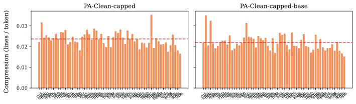

*Extrinsic (downstream LM):*
| Tokenizer | Val BPB ↓ | FLORES BPB (tr.) ↓ | Code BPB ↓ | MC-math ↑ | MBPP ↑ [95% CI] |
|---|---|---|---|---|---|
| CleanV1-pretok + PA-BPE (tuned data) [matched] | 0.729 | 1.169 | 0.533 | 0.295 | 0.190 [0.156, 0.226] |

*[proxy] companion-LM 1B-balanced Δ, factor: PA-BPE family* (Δ = B−A; BPB Δ<0 means B better; **bold** = p_adj<0.05):
| A | B | ΔVal | ΔFLORES (tr.) | ΔFLORES (all) | ΔBLiMP | ΔCode |
|---|---|---|---|---|---|---|
| GPT-4 pretok | clean pretok | -0.0020 | **-0.0079** | **-0.0089** | +0.0073 | -0.0060 |
| Base | Hybrid-window | -0.0061 | **-0.0090** | **-0.0062** | +0.0441 | -0.0095 |

### SuperBPE transition point & vocab size (t90k/128k vs t110k/130k, clean fw2full)

This ablation compares two SuperBPE settings that change together: the stage-1 to stage-2 transition vocab size (90k against 110k) and the final vocab size (128k against 130k).

The transition (90k to 110k) and the final vocab (128k to 130k) change together, so this is not a single-variable comparison. The later transition gives a higher sent/tok (0.0227 to 0.0232), a lower Gini (0.106 to 0.092), and a higher vocab utilization, at a lower Eng B/tok (5.01 to 4.87). Both now have standard-budget BPB (Val BPB 0.732 and FLORES bits-per-byte trained 1.161 for each); t110k has higher MC-math (0.288 against 0.268) and MBPP (0.202 against 0.196). Of the two settings, t110k/130k leads on these metrics.

| Tokenizer | Eng comp (B/tok) ↑ | Multiling. sent/tok ↑ | Vocab util ↑ | Vocab-util CoV ↓ | Vocab size | Avg langs/token ↑ | Gini ↓ | CER ↓ | Boundary-cross ↓ | Operator-isol ↑ | Byte-frag (benign) | Long toks (>64) | Junk toks (≥8) ↓ |
|---|---|---|---|---|---|---|---|---|---|---|---|---|---|
| CleanV1-pretok + PA-BPE + SuperBPE | **5.013** | 0.0227 | 0.550 | 0.4892 | 128,000 | **3.02** | 0.106 | 0.00043 | 0.02629 | **0.987** | 3435 | 0 | 77 |
| SuperBPE·clean-cap·hw·fw2full·t110k/130k | 4.869 | **0.0232** | **0.577** | 0.4544 | 130,000 | 2.88 | **0.092** | 0.00043 | 0.02358 | **0.987** | 4597 | 3 | 61 |
| SuperBPE·clean-cap·base·fw2full | 4.693 | 0.0220 | 0.543 | 0.4613 | 128,000 | 2.98 | 0.100 | 0.00043 | 0.02473 | 0.985 | 4217 | 1 | 53 |
| SuperBPE·clean-cap·base·fw2full·t110k/130k | 4.438 | 0.0219 | 0.539 | **0.4458** | 130,000 | 2.91 | 0.094 | 0.00043 | **0.02356** | 0.985 | 4756 | 1 | **42** |

*Faceted per-language compression (sentences/token), one pane per tokenizer:*

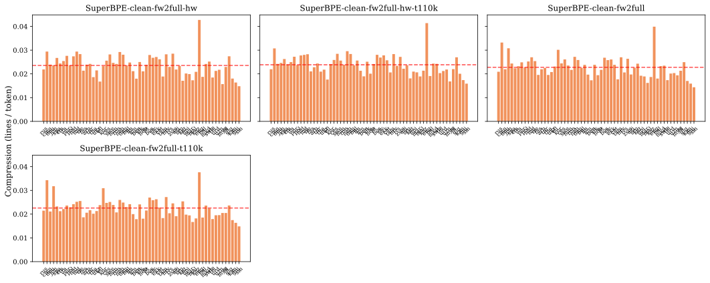

*Extrinsic (downstream LM):*
| Tokenizer | Val BPB ↓ | FLORES BPB (tr.) ↓ | Code BPB ↓ | MC-math ↑ | MBPP ↑ [95% CI] |
|---|---|---|---|---|---|
| CleanV1-pretok + PA-BPE + SuperBPE [matched] | 0.732 | 1.161 | 0.536 | 0.268 | 0.196 [0.162, 0.232] |
| SuperBPE·clean-cap·hw·fw2full·t110k/130k [matched] | 0.732 | 1.161 | 0.534 | 0.288 | 0.202 [0.168, 0.238] |

**Further ablations.** Additional design points, reported in full under *Additional ablations*:
- **PA-BPE training-data config (gpt4: balanced vs FineWeb2-full)**: training corpus on a fixed gpt4 pretok (balanced vs FineWeb2-full); FineWeb2-full is far fairer multilingually.
- **Parity tuning: European-family up-weighting (original ×1.0 → ×1.1 → ×1.2)**: European-family ratio strength; a higher ratio slightly raises English bytes per token at a small fairness cost.
- **Tuned config: semitic regroup of script-mismatched languages (with vs without)**: regrouping script-mismatched languages into the semitic group; effects are local to those scripts, not the global averages.
- **SuperBPE base, transition point & stage-2 preset**: balanced-data SuperBPE sweep over base, transition (64k/90k) and stage-2 preset.
- **SuperBPE training data (balanced vs FineWeb2-full)**: balanced vs FineWeb2-full under SuperBPE; FineWeb2-full restores the multilingual fairness lost on balanced data.
- **Hybrid-window vs base parity, under SuperBPE**: hybrid-window vs base parity across the SuperBPE pretok families.
- **Algorithm / pretok (plain BPE vs Unigram, right-align digits, gpt2-style)**: plain-BPE pretok variants and Unigram LM (the single non-merge algorithm point).

## Additional ablations

The design points referenced from the body's ablation section, in full. Same table and extrinsic conventions as the body ablations.

### PA-BPE training-data config (gpt4: balanced vs FineWeb2-full)

This ablation compares two training corpora for PA-BPE, the balanced mixture against FineWeb2-full, holding the pretokenizer, parity mode, and capping fixed.

The further FineWeb2-full to tuned refinements (European ratio up-weighting, two quality removals, semitic regroup) are isolated for apertus in the EU-weighting and semitic-regroup ablations. Punctuation and whitespace capping is a pretokenizer choice with its own ablation, not a data-config change.

| Tokenizer | Multiling. sent/tok ↑ | Gini ↓ | Vocab-util CoV ↓ | Vocab size | Eng comp (B/tok) ↑ | Vocab util ↑ | Avg langs/token ↑ | CER ↓ | Boundary-cross ↓ | Operator-isol ↑ | Dead vocab ↓ | Byte-frag (benign) | Long toks (>64) | Junk toks (≥8) ↓ |
|---|---|---|---|---|---|---|---|---|---|---|---|---|---|---|
| PA-gpt4-balanced | 0.0138 | 0.415 | 0.4619 | 127,826 | **4.610** | **0.689** | 2.62 | 0.00043 | **0.01205** | 0.472 | 4 | 2837 | 4 | 59 |
| PA-gpt4-fineweb2full | **0.0235** | **0.076** | **0.3755** | 127,825 | 4.433 | 0.590 | **2.93** | 0.00043 | 0.02226 | **0.505** | **3** | 5673 | 8 | **33** |

*Faceted per-language compression (sentences/token), one pane per tokenizer:*

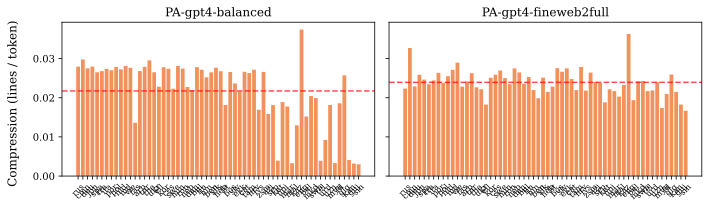

*Extrinsic (downstream LM):*
| Tokenizer | Val BPB ↓ | FLORES BPB (tr.) ↓ | Code BPB ↓ | MC-math ↑ | MBPP ↑ [95% CI] |
|---|---|---|---|---|---|
| PA-gpt4-balanced [matched] | 0.719 | 1.177 | 0.524 | - | - |
| PA-gpt4-fineweb2full [matched] | 0.728 | 1.169 | 0.531 | - | - |

*[proxy] companion-LM 1B-balanced Δ, factor: Training data* (Δ = B−A; BPB Δ<0 means B better; **bold** = p_adj<0.05):
| A | B | ΔVal | ΔFLORES (tr.) | ΔFLORES (all) | ΔBLiMP | ΔCode |
|---|---|---|---|---|---|---|
| Balanced | English | **+0.0511** | **+0.0333** | **+0.0082** | +0.0124 | +0.0401 |
| Balanced | Code | **+0.0363** | **+0.0188** | **-0.0133** | +0.0259 | +0.0248 |
| Claude bal | Claude eng | **+0.0475** | **+0.0281** | +0.0003 | -0.0141 | +0.0270 |
| Punct bal | Punct eng | **+0.0419** | **+0.0208** | **-0.0096** | +0.0190 | +0.0310 |
| Balanced | High-res | +0.0013 | **+0.0250** | **-0.0153** | +0.0212 | +0.0034 |
| Balanced | High-mid | +0.0023 | **+0.0164** | **+0.0044** | +0.0119 | +0.0031 |

### Parity tuning: European-family up-weighting (original ×1.0 → ×1.1 → ×1.2)

This ablation compares three European-family up-weighting strengths in the parity config: ×1.0 (original), ×1.1, and ×1.2.

×1.0 is the original (untuned) config. ×1.1 and ×1.2 are the tuned config (European ratio up-weighting, two quality removals, semitic regroup) at two up-weighting strengths, so original to ×1.1 bundles all the tuning changes and ×1.1 to ×1.2 isolates the European up-weighting strength. The trainer selects the group/language with the minimum `compression_rate / ratio`, so a higher European ratio gives more merges for English and European and more English compression.

| Tokenizer | Eng comp (B/tok) ↑ | Multiling. sent/tok ↑ | Gini ↓ | Vocab-util CoV ↓ | Vocab size | Vocab util ↑ | Avg langs/token ↑ | CER ↓ | Boundary-cross ↓ | Operator-isol ↑ | Byte-frag (benign) |
|---|---|---|---|---|---|---|---|---|---|---|---|
| Apertus-pretok + PA-BPE (untuned data) | 4.335 | 0.0233 | **0.075** | **0.3860** | 127,835 | 0.592 | **2.84** | 0.00043 | **0.02202** | **0.505** | 5679 |
| Apertus-pretok + PA-BPE (European ×1.1) | 4.335 | 0.0233 | 0.077 | 0.3976 | 127,835 | 0.601 | 2.80 | 0.00043 | 0.02205 | 0.499 | 5645 |
| Apertus-pretok + PA-BPE | **4.336** | 0.0233 | 0.081 | 0.4130 | 127,835 | **0.606** | 2.79 | 0.00043 | 0.02208 | 0.502 | 5592 |

*Faceted per-language compression (sentences/token), one pane per tokenizer:*

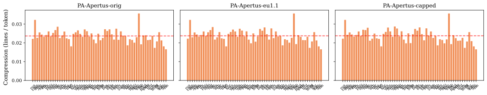

*Extrinsic (downstream LM):*
| Tokenizer | Val BPB ↓ | FLORES BPB (tr.) ↓ | Code BPB ↓ | MC-math ↑ | MBPP ↑ [95% CI] |
|---|---|---|---|---|---|
| Apertus-pretok + PA-BPE [matched] | 0.729 | 1.170 | 0.531 | 0.270 | 0.058 [0.038, 0.080] |

### Tuned config: semitic regroup of script-mismatched languages (with vs without)

This ablation tests regrouping script-mismatched languages (`ydd_Hebr`, Hebrew script; `kas/knc/uzs_Arab`, Arabic script) into the semitic group so they share script-appropriate merges.

This is one of the three tuned fixes, isolated at ×1.2. The effect is local to those scripts' per-language fairness and boundary-crossing, not the global averages.

| Tokenizer | Gini ↓ | Vocab-util CoV ↓ | Multiling. sent/tok ↑ | Boundary-cross ↓ | Vocab size | Eng comp (B/tok) ↑ | Vocab util ↑ | Avg langs/token ↑ | CER ↓ | Operator-isol ↑ | Byte-frag (benign) |
|---|---|---|---|---|---|---|---|---|---|---|---|
| Apertus-pretok + PA-BPE | 0.081 | 0.4130 | 0.0233 | 0.02208 | 127,835 | 4.336 | **0.606** | 2.79 | 0.00043 | **0.502** | 5592 |
| Apertus-pretok + PA-BPE (no semitic regroup) | 0.081 | **0.4109** | 0.0233 | 0.02208 | 127,835 | 4.336 | 0.605 | **2.80** | 0.00043 | 0.498 | 5601 |

*Faceted per-language vocabulary utilization, one pane per tokenizer:*

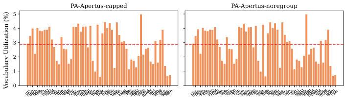

*Extrinsic (downstream LM):*
| Tokenizer | Val BPB ↓ | FLORES BPB (tr.) ↓ | Code BPB ↓ | MC-math ↑ | MBPP ↑ [95% CI] |
|---|---|---|---|---|---|
| Apertus-pretok + PA-BPE [matched] | 0.729 | 1.170 | 0.531 | 0.270 | 0.058 [0.038, 0.080] |

### SuperBPE base, transition point & stage-2 preset

This ablation sweeps the SuperBPE base, the stage-1 to stage-2 transition vocab size (64k and 90k), and the stage-2 preset on balanced training data.

| Tokenizer | Eng comp (B/tok) ↑ | Multiling. sent/tok ↑ | Vocab util ↑ | Vocab size | Vocab-util CoV ↓ | Avg langs/token ↑ | Gini ↓ | CER ↓ | Boundary-cross ↓ | Operator-isol ↑ | Lossless ↑ | Dead vocab ↓ | Byte-frag (benign) | Long toks (>64) | Junk toks (≥8) ↓ |
|---|---|---|---|---|---|---|---|---|---|---|---|---|---|---|---|
| SuperBPE(PA-base)·gpt4o·t90k | 5.620 | 0.0137 | **0.662** | 128,000 | **0.4906** | 2.73 | 0.428 | 0.00043 | 0.01127 | 0.509 | 0.9867 | 1 | 2445 | 4 | **50** |
| SuperBPE(PA-base)·gpt4o·t64k | 5.869 | **0.0143** | 0.602 | 128,000 | 0.5094 | 2.93 | 0.400 | 0.00043 | 0.01336 | 0.493 | 0.9867 | 1 | 2103 | 6 | 72 |
| SuperBPE(PA-base)·clean-c2·t90k | 5.148 | 0.0141 | 0.652 | 128,000 | 0.5124 | 2.62 | 0.397 | 0.00043 | 0.01087 | **0.987** | 0.9867 | **0** | 2359 | 5 | 63 |
| SuperBPE(PA-base)·clean-c3·t90k | 5.598 | 0.0136 | 0.651 | 128,000 | 0.4978 | 2.78 | 0.429 | 0.00043 | **0.01030** | 0.627 | 0.9867 | **0** | 2357 | 5 | 55 |
| SuperBPE(plain-base)·gpt4o·noNFC | **6.159** | 0.0139 | 0.484 | 128,000 | 0.6230 | **3.39** | **0.387** | **0.00000** | 0.02663 | 0.452 | 1.0000 | 8 | 1156 | 6 | 92 |

*Faceted per-language compression (sentences/token), one pane per tokenizer:*

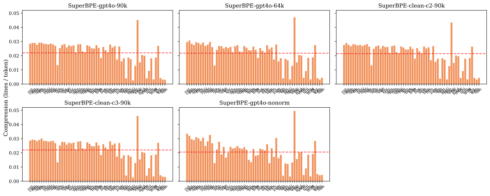

*Extrinsic (downstream LM):*
| Tokenizer | Val BPB ↓ | FLORES BPB (tr.) ↓ | Code BPB ↓ | MC-math ↑ | MBPP ↑ [95% CI] |
|---|---|---|---|---|---|
| SuperBPE(PA-base)·gpt4o·t90k [matched] | 0.729 | 1.181 | 0.528 | - | - |
| SuperBPE(PA-base)·gpt4o·t64k [matched] | 0.729 | 1.180 | 0.530 | - | - |
| SuperBPE(PA-base)·clean-c2·t90k [matched] | 0.729 | 1.169 | 0.526 | - | - |
| SuperBPE(PA-base)·clean-c3·t90k [matched] | 0.730 | 1.173 | 0.531 | - | - |
| SuperBPE(plain-base)·gpt4o·noNFC [matched] | 0.724 | 1.173 | 0.525 | - | - |

*[proxy] companion-LM 1B-balanced Δ, factor: SuperBPE* (Δ = B−A; BPB Δ<0 means B better; **bold** = p_adj<0.05):
| A | B | ΔVal | ΔFLORES (tr.) | ΔFLORES (all) | ΔBLiMP | ΔCode |
|---|---|---|---|---|---|---|
| GPT-4o BPE | + SuperBPE | +0.0122 | **+0.0157** | **+0.0063** | +0.0045 | +0.0066 |
| PA-BPE bal | + SuperBPE | +0.0037 | -0.0049 | **-0.0093** | +0.0032 | -0.0059 |
| t90k | t64k | +0.0001 | -0.0005 | -0.0004 | +0.0036 | +0.0022 |
| C2 (bal) | C3 (bal) | +0.0011 | **+0.0042** | **-0.0064** | -0.0186 | +0.0047 |

*[proxy] companion-LM 1B-balanced Δ, factor: NFC normalization* (Δ = B−A; BPB Δ<0 means B better; **bold** = p_adj<0.05):
| A | B | ΔVal | ΔFLORES (tr.) | ΔFLORES (all) | ΔBLiMP | ΔCode |
|---|---|---|---|---|---|---|
| GPT-4o | + NFC | +0.0004 | -0.0033 | -0.0017 | +0.0320 | +0.0003 |
| Claude | + NFC | **-0.0012** | -0.0045 | **-0.0052** | -0.0080 | -0.0006 |
| RightAlign | + NFC | **-0.0007** | **-0.0061** | **-0.0056** | -0.0031 | -0.0002 |

### SuperBPE training data (balanced vs FineWeb2-full)

This ablation compares two training corpora under SuperBPE, the balanced mixture against FineWeb2-full.

| Tokenizer | Multiling. sent/tok ↑ | Gini ↓ | Eng comp (B/tok) ↑ | Vocab size | Vocab util ↑ | Vocab-util CoV ↓ | Avg langs/token ↑ | CER ↓ | Boundary-cross ↓ | Operator-isol ↑ | Dead vocab ↓ | Byte-frag (benign) | Long toks (>64) | Junk toks (≥8) ↓ |
|---|---|---|---|---|---|---|---|---|---|---|---|---|---|---|
| SuperBPE(PA-base)·gpt4o·t90k | 0.0137 | 0.428 | **5.620** | 128,000 | **0.662** | 0.4906 | 2.73 | 0.00043 | **0.01127** | **0.509** | 1 | 2445 | 4 | **50** |
| SuperBPE·gpt4·base·fw2full | 0.0223 | **0.092** | 5.071 | 128,000 | 0.522 | **0.4411** | 3.22 | 0.00043 | 0.02378 | 0.506 | 1 | 4522 | 11 | 70 |
| SuperBPE·gpt4·hw·fw2full | **0.0232** | 0.109 | 5.560 | 128,000 | 0.537 | 0.4821 | **3.27** | 0.00043 | 0.02712 | 0.467 | **0** | 3444 | 19 | 104 |

*Faceted per-language compression (sentences/token), one pane per tokenizer:*

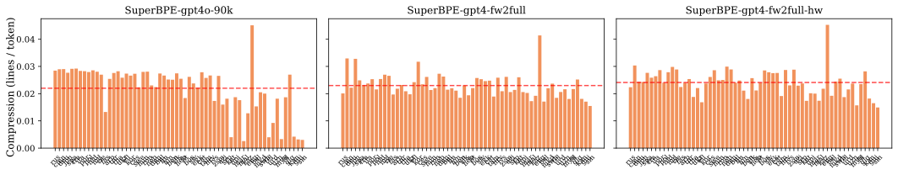

*Extrinsic (downstream LM):*
| Tokenizer | Val BPB ↓ | FLORES BPB (tr.) ↓ | Code BPB ↓ | MC-math ↑ | MBPP ↑ [95% CI] |
|---|---|---|---|---|---|
| SuperBPE(PA-base)·gpt4o·t90k [matched] | 0.729 | 1.181 | 0.528 | - | - |
| SuperBPE·gpt4·hw·fw2full [matched] | pending | pending | pending | 0.265 | 0.070 [0.048, 0.092] |

### Hybrid-window vs base parity, under SuperBPE

This ablation compares the hybrid-window parity rule against base parity across the SuperBPE pretokenizer families.

| Tokenizer | Eng comp (B/tok) ↑ | Multiling. sent/tok ↑ | Gini ↓ | Vocab-util CoV ↓ | Vocab size | Vocab util ↑ | Avg langs/token ↑ | CER ↓ | Boundary-cross ↓ | Operator-isol ↑ | Dead vocab ↓ | Byte-frag (benign) | Long toks (>64) | Junk toks (≥8) ↓ |
|---|---|---|---|---|---|---|---|---|---|---|---|---|---|---|
| SuperBPE·apertus-cap·base·fw2full | 5.011 | 0.0225 | 0.100 | 0.4591 | 128,000 | **0.551** | 3.06 | 0.00043 | 0.02476 | 0.494 | **0** | 4126 | 1 | 60 |
| Apertus-pretok + PA-BPE + SuperBPE | 5.402 | 0.0230 | 0.110 | 0.4992 | 128,000 | 0.544 | 3.14 | 0.00043 | 0.02686 | 0.466 | **0** | 3441 | 1 | 76 |
| SuperBPE·clean-cap·base·fw2full | 4.693 | 0.0220 | 0.100 | 0.4613 | 128,000 | 0.543 | 2.98 | 0.00043 | 0.02473 | 0.985 | **0** | 4217 | 1 | **53** |
| CleanV1-pretok + PA-BPE + SuperBPE | 5.013 | 0.0227 | 0.106 | 0.4892 | 128,000 | 0.550 | 3.02 | 0.00043 | 0.02629 | **0.987** | **0** | 3435 | 0 | 77 |
| SuperBPE·gpt4·base·fw2full | 5.071 | 0.0223 | **0.092** | **0.4411** | 128,000 | 0.522 | 3.22 | 0.00043 | **0.02378** | 0.506 | 1 | 4522 | 11 | 70 |
| SuperBPE·gpt4·hw·fw2full | **5.560** | **0.0232** | 0.109 | 0.4821 | 128,000 | 0.537 | **3.27** | 0.00043 | 0.02712 | 0.467 | **0** | 3444 | 19 | 104 |

*Faceted per-language compression (sentences/token), one pane per tokenizer:*

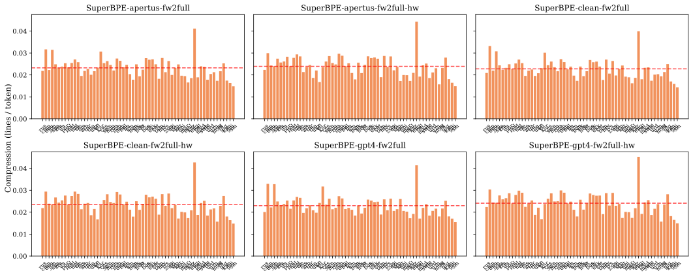

*Extrinsic (downstream LM):*
| Tokenizer | Val BPB ↓ | FLORES BPB (tr.) ↓ | Code BPB ↓ | MC-math ↑ | MBPP ↑ [95% CI] |
|---|---|---|---|---|---|
| Apertus-pretok + PA-BPE + SuperBPE [matched] | 0.733 | 1.176 | 0.541 | 0.269 | 0.004 [0.000, 0.010] |
| CleanV1-pretok + PA-BPE + SuperBPE [matched] | 0.732 | 1.161 | 0.536 | 0.268 | 0.196 [0.162, 0.232] |
| SuperBPE·gpt4·hw·fw2full [matched] | pending | pending | pending | 0.265 | 0.070 [0.048, 0.092] |

### Algorithm / pretok (plain BPE vs Unigram, right-align digits, gpt2-style)

This ablation compares plain-BPE pretokenizer variants (gpt2-style, right-aligned digits) against Unigram LM, the single non-merge algorithm point.

| Tokenizer | Operator-isol ↑ | Eng comp (B/tok) ↑ | Multiling. sent/tok ↑ | Gini ↓ | Vocab size | Vocab util ↑ | Vocab-util CoV ↓ | Avg langs/token ↑ | CER ↓ | Boundary-cross ↓ | Dead vocab ↓ | Byte-frag (benign) | Junk toks (≥8) ↓ |
|---|---|---|---|---|---|---|---|---|---|---|---|---|---|
| BPE-gpt2 | **0.987** | 4.761 | 0.0134 | 0.389 | 128,256 | 0.507 | 0.5843 | **3.24** | 0.00000 | **0.02119** | **0** | 1249 | 117 |
| BPE-rightalign | 0.478 | **4.796** | **0.0137** | 0.384 | 128,256 | 0.500 | 0.5809 | **3.24** | 0.00000 | 0.02668 | 5 | 1290 | **116** |
| Unigram-gpt4o | 0.887 | 3.093 | 0.0130 | **0.306** | 128,256 | **0.583** | **0.5201** | 2.84 | 0.00000 | 0.08215 | 12 | 9932 | 304 |

*Faceted per-language compression (sentences/token), one pane per tokenizer:*

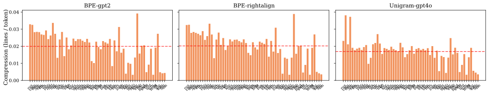

*Extrinsic (downstream LM):*
| Tokenizer | Val BPB ↓ | FLORES BPB (tr.) ↓ | Code BPB ↓ | MC-math ↑ | MBPP ↑ [95% CI] |
|---|---|---|---|---|---|
| BPE-gpt2 [matched] | 0.713 | 1.157 | 0.515 | - | - |
| BPE-rightalign [matched] | 0.712 | 1.160 | 0.519 | 0.295 | 0.062 [0.042, 0.084] |
| Unigram-gpt4o [matched] | 0.731 | 1.190 | 0.554 | - | - |

*[proxy] companion-LM 1B-balanced Δ, factor: Algorithm* (Δ = B−A; BPB Δ<0 means B better; **bold** = p_adj<0.05):
| A | B | ΔVal | ΔFLORES (tr.) | ΔFLORES (all) | ΔBLiMP | ΔCode |
|---|---|---|---|---|---|---|
| BPE GPT-4o | Unigram | **+0.0331** | **+0.0329** | **+0.0472** | +0.0545 | +0.0355 |
| BPE Claude | Unigram | **+0.0304** | **+0.0308** | **+0.0408** | -0.0037 | +0.0355 |
| BPE RightAlign | Unigram | **+0.0300** | **+0.0312** | **+0.0452** | +0.0336 | +0.0343 |

*[proxy] companion-LM 1B-balanced Δ, factor: Unigram tuning* (Δ = B−A; BPB Δ<0 means B better; **bold** = p_adj<0.05):
| A | B | ΔVal | ΔFLORES (tr.) | ΔFLORES (all) | ΔBLiMP | ΔCode |
|---|---|---|---|---|---|---|
| Untuned | Tuned | +0.0018 | **+0.0019** | **+0.0061** | -0.0846 | +0.0027 |

### SuperBPE vs. its PA-BPE base: what the superword stage changes

Each SuperBPE is compared to the PA-BPE subword base it was grown from (stage-1 = that base; stage-2 = superword merges). **Added** = tokens only in the SuperBPE; **sacrificed** = subword tokens only in the base; a **superword** has an internal space (spans ≥2 pretokenized words). Added-token usage is measured on FLORES devtest, code firing on a fixed code sample. Source: the intrinsic pipeline's SuperBPE-vs-base analysis.

| SuperBPE | Base | Pretok | Mode | Shared | Sacrificed | Added | Superword % | Eng added-share | Mean added-share | Code added % |
|---|---|---|---|---|---|---|---|---|---|---|
| CleanV1-pretok + PA-BPE + SuperBPE | CleanV1-pretok + PA-BPE (tuned data) | clean | hw | 93,506 | 34,329 | 34,494 | 38% | 0.184 | 0.063 | 5.4% |
| Apertus-pretok + PA-BPE + SuperBPE | Apertus-pretok + PA-BPE | apertus | hw | 92,467 | 35,368 | 35,533 | 41% | 0.214 | 0.077 | 18.9% |
| SuperBPE·gpt4·hw·fw2full | PA-gpt4-fineweb2full | gpt4 | hw | 92,934 | 34,891 | 35,066 | 42% | 0.219 | 0.068 | 20.9% |
| SuperBPE·clean-cap·base·fw2full | PA-Clean-capped-base | clean | base | 94,460 | 33,375 | 33,540 | 20% | 0.426 | 0.100 | 23.5% |
| SuperBPE·apertus-cap·base·fw2full | PA-Apertus-base | apertus | base | 93,928 | 33,907 | 34,072 | 23% | 0.464 | 0.107 | 38.8% |
| SuperBPE·gpt4·base·fw2full | PA-gpt4-fw2full-base | gpt4 | base | 94,513 | 33,312 | 33,487 | 21% | 0.457 | 0.111 | 42.6% |

**Sacrificed subwords.** The removed subwords are mostly low-resource, non-Latin-script fragments (for example ` zdravje`, ` хүүхд`, `nuti`, ` brifysgol`, `�້າງ`, ` ກົ`). The SuperBPE stage removes these and adds superwords.

**Added tokens.** Across all pairs the added tokens are used mostly by English and other space-delimited languages, and almost never by CJK, Indic, or Thai (near zero). Hybrid-window bases add more superwords (38–42% of added tokens) than base-parity bases (20–23%). Base-parity additions are the most English-concentrated (Eng added-share 0.43–0.46, against 0.18–0.22 for hybrid-window).

**Code-related superwords (hybrid-window pairs).**
- **clean**: 5.4% of code-sample tokens are SuperBPE-added, and 266 added superwords contain code syntax or keywords. In-sample superwords: ` compute the`, ` for i in`, ` if i`, ` not in`, ` or `, ` over a`
- **apertus**: 18.9% of code-sample tokens are SuperBPE-added, and 2831 added superwords contain code syntax or keywords. In-sample superwords: ` + `, ` - `, ` = `, ` compute the`, ` for i`, ` if i`, ` in range`, ` not in`, ` or `, ` over a`
- **gpt4**: 20.9% of code-sample tokens are SuperBPE-added, and 2866 added superwords contain code syntax or keywords. In-sample superwords: ` + `, ` - `, ` = `, ` compute the`, ` for i`, ` if i`, ` in range`, ` not in`, ` or `, ` over a`

The pretokenizer determines the code impact. clean-multi keeps operators as separate tokens (its space-only leading rule blocks operator+space merges), so its code superwords are mostly natural-language phrases inside comments and strings. apertus and gpt4 allow superwords that span operators and markup (for example ` = `, ` + `, `) * `, `] =`, `<div class`), which produces 3–4× as many disrupted code tokens. The clean-multi SuperBPE has the fewest disrupted code tokens of the SuperBPE set.

## Candidate selection

The ablations above fix the design: parity-aware BPE with hybrid-window, NFC, the clean-multi plus2/plus3 pretokenizers with `repcap8` and the `{1,16}` caps, and the `consv2` parity config. The remaining search, run in the training repository (TRAINING.md, Provenance), was over the data side: per-family `quota_bytes`, the global-merge count `gm`, and the vocabulary size. Compression in this section is FLORES devtest token count relative to Apertus v1 (negative = fewer tokens).

**Data volume and `gm` are the levers; per-family ratios mostly are not.** The trainer runs a global phase (the first `gm` merges, chosen by data-weighted pooled frequency, with ratios not applied), then a parity phase (ratio-controlled). For the high-data languages, 82 to 88% of FLORES tokens come from global-phase merges (English 85.7%, Mandarin about 88%, Hindi 82%, Arabic 87%). Three consequences:

- High-data languages compress by their share of the global data pool, and per-family ratios change them little: raising the romance ratio from 2.2 to 3.0 moved French by one merge, and an indoaryan/semitic ratio raise left Hindi and Arabic unchanged. A European data boost raised European compression and cost English (its pool share fell from 42% to 24%); English recovered only when its own data was raised in step, from 12.7 to about 21 GB.
- Competition is mostly within-script. A 2 to 4 GB Hindi data boost moved Hindi from +9.2% to −4.7% and −10.3% while English and the European set moved 0.3 to 0.8 points. Cutting 1 GB of semitic data cost Arabic +8.2% and moved the European average by only −0.2%, so cross-script reallocation was abandoned as a lever.
- `gm` sets the head-versus-tail split: more global merges favor the high-data head (at 200k, gm 120k to 130k moved English −0.3% and Mandarin −1.8% at a small tail and Indic cost); fewer merges enlarge the parity phase for the tail. Parity-ratio floors for the tiny tail languages were tried and abandoned: the parity phase is zero-sum, so the floored tail took merges from Hindi (+13.5%) and Arabic (+6.0%).

**131k against 200k.** At 131072, only the French/German own-data boost with a Sinotibetan cut (the `frde` line that shipped as `preliminary_euh`) reached English and the European averages all within +2% of Apertus v1, and its cost is Mandarin (17% less compressed than under Apertus v1). At 200k, five configs reached the same point. That is the basis for `preliminary_mul_200k`: the larger vocabulary compresses the high-resource head and the low-resource tail at the same time, where the 131k configs trade one for the other.

**The shipped recipes.** `preliminary_mul` is the `consv2` baseline with the `reparam` ratio adjustment (the fairest point). `preliminary_enh` raises English to the full FineWeb-1 sample with a moderate European boost (`engfull_eu3`). `preliminary_euh` boosts French and German data and cuts Sinotibetan (`frde2`). `preliminary_mul_200k` (`eusino_v2c_frde_kr120`, gm 130k) adds a French quota boost that raises French compression to Apertus v1 parity while German, Spanish, and Italian compress more than under Apertus v1; Korean is its one remaining weak spot (about +14% tokens against Apertus v1: the 120 MB Korean data addition in the recipe changed Korean by 0.3%, and the larger Korean boosts that did fix it either cost Japanese or made Korean denser than Mandarin). Exact quotas and variant keys are in TRAINING.md; the four-way comparison and the recommendation are in REPORT_focus_candidates.md.

**Candidate identity.** The four shipped candidates and their design lineage. All four use the `consv2` (rebalanced) parity data with `repcap8` run-length capping and the `eng5g` English boost, plus the per-candidate data dial below. The bare `CleanVN-pretok + PA-BPE (tuned data)` rows elsewhere in this record are the earlier tuned-data family baselines (no `repcap8`, no `consv2` dial), distinct from these shipped builds.

| Candidate | Lineage | Pretokenizer | Data dial | Vocab |
|---|---|---|---|---|
| `preliminary_mul_200k` (recommended) | CleanV2-pretok + PA-BPE | clean-multi-plus2 + repcap8 | `eusino_v2c` + `frde_kr120` | 200064 |
| `preliminary_mul` | CleanV3-pretok + PA-BPE | clean-multi-plus3 + repcap8 | `reparam` | 131072 |
| `preliminary_enh` | CleanV2-pretok + PA-BPE | clean-multi-plus2 + repcap8 | `engfull_eu3` | 131072 |
| `preliminary_euh` | CleanV2-pretok + PA-BPE | clean-multi-plus2 + repcap8 | `frde2` | 131072 |

**Where the search ended.** The recommended tokenizers and the current Apertus production baseline, on the decision metrics. The multilingual intrinsic columns (sent/tok, Gini, vocab-util CoV, avg langs/token, vocab util) are computed on the broad FLORES set; Eng B/tok is on FineWeb-Edu and AST align on StarCoder. Val BPB, FLORES BPB, MC-math, and MBPP come from the downstream language models. FLORES BPB here is the macro-mean over the 31 FLORES languages in the LM training set. `pending` means the run is mapped but not yet measured, and `-` means not run.

| Tokenizer | Role | Multiling. sent/tok ↑ | Gini ↓ | Vocab-util CoV ↓ | Avg langs/token ↑ | Eng B/tok ↑ | Vocab util ↑ | AST align ↑ | Val BPB ↓ | FLORES BPB (trained) [95% CI] ↓ | FLORES BPB σ (trained) ↓ | MC-math ↑ | MBPP ↑ | Gate |
|---|---|---|---|---|---|---|---|---|---|---|---|---|---|---|
| preliminary_mul_200k (CleanV2-pretok + PA-BPE, 200k) | headline (200k) | 0.0239 | 0.118 | 0.5041 | 2.28 | 4.51 | 0.545 | 0.681 | 0.720 | 1.163 [1.057, 1.269] | 0.302 | 0.247 | 0.228 [0.192, 0.264] | warn |
| preliminary_mul (CleanV3-pretok + PA-BPE, rebalanced) | 131k candidate: fairest / most balanced | 0.0235 | 0.088 | 0.4180 | 2.67 | 4.33 | 0.639 | 0.689 | 0.728 | 1.167 [1.061, 1.274] | 0.302 | 0.285 | 0.212 [0.176, 0.248] | warn |
| preliminary_enh (CleanV2-pretok + PA-BPE, English-boosted) | 131k candidate: highest English compression | 0.0223 | 0.121 | 0.5320 | 2.75 | 4.49 | 0.598 | 0.679 | 0.725 | 1.164 [1.057, 1.271] | 0.304 | 0.273 | 0.224 [0.188, 0.260] | warn |
| preliminary_euh (CleanV2-pretok + PA-BPE, Fr/De-boosted) | 131k candidate: highest European compression | 0.0219 | 0.138 | 0.5852 | 2.68 | 4.42 | 0.621 | 0.682 | 0.725 | 1.167 [1.060, 1.275] | 0.305 | 0.279 | 0.182 [0.148, 0.216] | warn |
| Apertus v1 (production) | comparator (production) | 0.0198 | 0.205 | 0.5133 | 2.86 | 4.60 | 0.561 | 0.488 | 0.720 | 1.168 [1.063, 1.272] | 0.297 | 0.257 | 0.000 [0.000, 0.000] | warn |

`warn` is advisory, not disqualifying. For the NFC candidates it flags exact-match below 1.0 (canonical re-spelling, not loss); for the non-NFC Apertus v1 (exact-match 1.0) it flags long and junk tokens. MC-math is a single run. MBPP now has a paired-bootstrap 95% CI for all five rows, all under `generation_spec` `v2-2026-07-30` (`bootstrap_mathcode_significance.py` re-run 2026-08-27), replacing the 2026-07-19 point estimates read under the pre-v2 decoding contract (Apertus v1 0.000 is unchanged across both conventions; the four candidates moved: `preliminary_mul_200k` 0.206 to 0.228, `preliminary_mul` 0.170 to 0.212, `preliminary_enh` 0.154 to 0.224, `preliminary_euh` 0.102 to 0.182).

Across the 15 tokenizers with both numbers, Spearman ρ(AST align, MBPP) = +0.632 (p = 0.011). <!--prov: results/ast_mbpp_correlation.json#spearman_rho--> AST alignment is on StarCoder snippets (multi-language); MBPP is Python pass-rate at 1B tokens, so the relationship is indicative, not a guarantee. (Was reported as +0.657 over 14 tokenizers; Apertus v1's math+code run has since finished, adding a 15th point at MBPP 0.000, and the panel's AST was recomputed on real StarCoder. Recompute with `scripts/ast_mbpp_correlation.py`.)

## Candidates and references across FLORES sets

This table shows multilingual compression (sent/tok), fairness (Gini), and vocabulary utilization for every candidate and reference at all three FLORES sets (core, broad, full). The full intrinsic tables, with every column, are in the appendix.

| Tokenizer | sent/tok ↑ (core) | sent/tok ↑ (broad) | sent/tok ↑ (full) | Gini ↓ (core) | Gini ↓ (broad) | Gini ↓ (full) | Vocab util ↑ (core) | Vocab util ↑ (broad) | Vocab util ↑ (full) |
|---|---|---|---|---|---|---|---|---|---|
| Apertus-pretok + PA-BPE | 0.0252 | 0.0233 | 0.0203 | 0.068 | 0.081 | 0.093 | 0.252 | 0.606 | 0.851 |
| CleanV1-pretok + PA-BPE (tuned data) | 0.0251 | 0.0232 | 0.0201 | 0.067 | 0.081 | 0.098 | 0.252 | 0.605 | 0.853 |
| CleanV2-pretok + PA-BPE (tuned data) | 0.0252 | 0.0233 | 0.0203 | 0.066 | 0.081 | 0.093 | 0.252 | 0.607 | 0.854 |
| CleanV3-pretok + PA-BPE (rebalanced data) | 0.0255 | 0.0233 | 0.0204 | 0.066 | 0.087 | 0.098 | 0.263 | 0.625 | 0.849 |
| CleanV3-pretok + PA-BPE (base parity, rebalanced data) | 0.0235 | 0.0217 | 0.0186 | 0.092 | 0.095 | 0.107 | 0.240 | 0.559 | 0.776 |
| Apertus-pretok + PA-BPE + SuperBPE | 0.0259 | 0.0230 | 0.0212 | 0.085 | 0.110 | 0.102 | 0.266 | 0.544 | 0.757 |
| CleanV1-pretok + PA-BPE + SuperBPE | 0.0255 | 0.0227 | 0.0208 | 0.080 | 0.106 | 0.103 | 0.266 | 0.550 | 0.776 |
| Apertus v1 (production) | 0.0275 | 0.0198 | 0.0142 | 0.071 | 0.205 | 0.313 | 0.344 | 0.561 | 0.648 |
| Gemma 3 | 0.0302 | 0.0244 | 0.0193 | 0.055 | 0.106 | 0.150 | 0.222 | 0.430 | 0.520 |
| GLM | 0.0225 | 0.0126 | 0.0116 | 0.206 | 0.379 | 0.354 | 0.251 | 0.347 | 0.405 |
| Kimi | 0.0217 | 0.0163 | 0.0144 | 0.153 | 0.199 | 0.213 | 0.173 | 0.225 | 0.275 |
| Qwen 3 | 0.0223 | 0.0136 | 0.0131 | 0.181 | 0.320 | 0.280 | 0.228 | 0.314 | 0.373 |
| Qwen 3.5 | 0.0295 | 0.0211 | 0.0160 | 0.099 | 0.180 | 0.242 | 0.234 | 0.379 | 0.445 |
| EuroLLM | 0.0276 | 0.0121 | 0.0116 | 0.066 | 0.459 | 0.402 | 0.363 | 0.665 | 0.758 |
| Llama 4 | 0.0302 | 0.0228 | 0.0172 | 0.071 | 0.153 | 0.221 | 0.273 | 0.480 | 0.559 |
| OLMo 2 | 0.0183 | 0.0114 | 0.0109 | 0.215 | 0.353 | 0.339 | 0.206 | 0.277 | 0.342 |
| K2 Think | 0.0223 | 0.0136 | 0.0131 | 0.181 | 0.320 | 0.280 | 0.228 | 0.314 | 0.373 |

## Missing evidence

- **SuperBPE·gpt4·hw·fw2full has no standard run yet**, so its Val and FLORES BPB are pending. Its math+code run is in (MC-math 0.265, MBPP 0.070).
- **Extrinsic coverage is uneven.** Not every tokenizer has both a standard and a math+code run, and MultiBLiMP and MGSM are missing for some; where a matched run is absent, the ablation rests on the 1B proxy.
- **Extrinsic numbers are single runs without seed variance.** MBPP is the exception (it has a paired-bootstrap CI). The MC-math difference between candidates (0.295 for CleanV1-pretok + PA-BPE (tuned data) against 0.270 for Apertus-pretok + PA-BPE) has no CI and is small.
- **The LMs are small proxies.** Whether the parity-aware BPE fairness difference or the SuperBPE Eng B/tok difference is larger at the target model scale is not measured here.
- **Vocabulary size is not swept.** Every candidate is near 128–131k, and size varies only alongside the SuperBPE transition rows, so it is confounded with the superword stage. A 64k/128k/256k sweep on one fixed design would separate the two.
- **NFC against no-NFC is not isolated** (the single noNFC tokenizer also differs in base and algorithm), and the references are not vocab-size-matched to the candidates, so the reference compression differences partly reflect vocabulary size. Newer algorithms are deferred because their code is not yet production-grade (see Methods).

## Terminology

Tokenizer-design vocabulary used throughout this record. The full metric, corpus, and gate definitions are in *Methods and metrics* below.

**Pretokenization and algorithm**
- **Pretok / pretokenizer**: the regex that splits raw text into pre-tokens before BPE merges run. Two families appear in this record: `Apertus-pretok` (GPT-4-class) and `CleanVN-pretok` (the multilingual-safe "clean-multi" family, V1 baseline → V2 with apostrophe forward-attach → V3 with apostrophe forward + trailing attach).
- **NFC**: Unicode Normalization Form C. Rewrites visually-identical characters into their canonical composed form (e.g. `é` always stored as one codepoint, never as `e` + combining-acute). All candidates apply NFC before pretokenization; Apertus v1 production does not.
- **BPE**: byte-pair encoding; the standard merging algorithm.
- **PA-BPE**: parity-aware BPE. Merges biased toward low-resource languages so they get proportionally more vocab capacity than under plain frequency-driven BPE.
- **Hybrid+window (HW)**: PA-BPE training mode with a global-merge warmup phase under a moving window before parity-driven merging takes over. Production target for the candidates in this record.
- **SuperBPE**: a stage-2 extension on top of any BPE base. Drops word boundaries and learns cross-word merges (e.g. `def main` as one token).

**Tokenizer-design data configs** (per-family `ratio` weighting in the training corpus; the mechanics are in *Training-data compositions* under Methods)
- **tuned**: the v5 hand-tuned per-family weighting: European family ×1.2, two data-quality removals, and script-mismatch regroup into `semitic`. The four shipped candidates (`preliminary_*`) are not plain `tuned`: on top of it they apply the v6 `consv2` reweighting, extra English (`eng5g`), and per-candidate data dials (`reparam` for `preliminary_mul`; `engfull_eu3` for `preliminary_enh`; `frde2` for `preliminary_euh`; `eusino_v2c` + `frde_kr120` for `preliminary_mul_200k`). So `tuned` alone does not describe a shipped candidate's data composition; the design-matrix `Training data` column gives each one in full.
- **rebalanced**: per-family weighting derived from a `max(data volume, speaker count)` formula. Drops the European boost.
- **untuned**: baseline weighting from FLORES line lengths; no adjustments.

## Methods and metrics

This section is the complete reference: the evaluation corpora, the full metric and safety-gate definitions, and the tokenizer design matrix.

### Evaluation corpora

**Intrinsic, multilingual (FLORES / FLORES+)** (three corpora of increasing breadth):
- **core**: 13 high-resource languages (FLORES dev split, 997 sentences/language).
- **broad**: 60 languages spanning high-to-mid resource levels (FLORES dev split, 997 sent/lang). The main study set: the headline intrinsic numbers and the ablations are computed on it.
- **full**: all available FLORES+ languages (devtest split, 1012 sent/lang). The widest multilingual view.

**Intrinsic, English and code:**
- **FineWeb-Edu**: English web corpus; the source for English compression (Eng B/tok). English-only.
- **StarCoder**: multi-language code corpus (19 programming languages); the source for AST alignment and operator isolation. Its Python+JavaScript subset also feeds the vocabulary-usage corpus below.

**Extrinsic (downstream LM):**
- **LM training/validation mix**: 35% FineWeb-Edu (English), 30% filtered FineWeb2 (30 languages, top-33% quality), 15% FineMath-4+, 15% StarCoderData (top tier). The tokenizer and its language model are trained on this mixture; Val BPB is measured on its held-out validation split.
- **trained-FLORES BPB set (31 languages)**: the FLORES languages present in the LM training mix. The headline FLORES BPB in this record is the macro-mean over these 31.
- **downstream LM FLORES BPB set (214 languages)**: the full FLORES set the language models can be scored on. It contains languages absent from training, so this record uses only the 31-language (in-training) macro; the full 214-language BPB is not reported.

**Vocabulary usage:**
- **per-language vocab utilization** (distinct vocabulary ids used per language): FLORES dev, 211 languages.
- **vocabulary-usage buckets and scaffold** (active / rare / uncommon / unseen / scaffold, defined in REPORT_focus_candidates.md §3.1): a 49.2 MB FineWeb sample over the FLORES-200 language set (equal byte budget per language, seed 0; FineWeb2 per language, English from FineWeb-1) plus FineMath-4+ and StarCoder (Python+JavaScript).

### Metrics

**Intrinsic efficiency and fairness (from the analysis runs):**
- **Eng comp (B/tok) ↑**: FineWeb-Edu *English* compression, **bytes per token** (more bytes/token = more compression). Measured standalone on a FineWeb-Edu English snippet; English-only.
- **Multiling. sent/tok ↑**: average **FLORES parallel sentences (lines) encoded per token** (more = more multilingual compression). This is the library's native `compression_rate` for the line-measured FLORES run, reported as-is (so it points the same way as the English column: higher = better). Values are small (~0.02–0.05; the reciprocal is tokens/sentence). Computed on the run's language set; **not** comparable to the English bytes/token column (different unit & corpus). Compare within the column.
- **Gini ↓**: cross-language fairness of byte-normalized token cost: 0 = every language equally cheap to encode, 1 = maximally unfair.
- **Vocab util ↑**: fraction of the **learned** vocabulary (special/reserved tokens excluded from the denominator) that appears when encoding the corpus (corpus-dependent; differs between runs, as expected).
- **Vocab-util CoV ↓**: coefficient of variation of per-language vocab utilization (lower = each language gets a similarly sized share of the vocabulary).
- **Avg langs/token ↑**: cross-language token-sharing metric. For each learned merge token used at least once on the multilingual corpus, count the distinct languages it is emitted in (threshold `K=1`, any occurrence); average across used merge tokens. Single-character base tokens (the byte-level 256-byte alphabet) and declared special/reserved tokens are excluded, so the metric reflects *learned* cross-language sharing rather than structural byte coverage. Range `[1, n_languages]`; higher = more sharing. Reported on each FLORES set independently (the corpus determines the language set).
- **AST align ↑**: fraction of tree-sitter AST nodes (identifier / keyword / operator / etc., pooled) whose start and end byte offsets both fall on a tokenizer boundary, on StarCoder snippets across 19 programming languages; higher = the tokenizer respects code syntax more often. Uses its own code corpus, independent of the natural-language subset.
- **Operator-isol ↑**: fraction of math operators tokenized standalone (vs attached to operands); near 1.0 = clean operator separation (helps arithmetic).
- **CER ↓**: character error rate of encode→decode round-trip (0 = perfect). Severity companion to *Lossless* below (which measures how *often*, not how *much*).
- **Boundary-cross ↓**: fraction of tokens that fuse bytes across a UTF-8 character boundary (unrecoverable merges). Concentrates in multi-byte scripts (CJK/Indic/Arabic/emoji). The global average is mostly ASCII, so it sits near 0; see the per-language faceted plots.
- **Special toks**: count of tokens the tokenizer adds outside its learned vocabulary: declared special tokens (`<bos>`, `<eos>`, `<unk>`, `<pad>`, chat markers) plus reserved/control tokens (`<unused123>`, `[multimodal]`). Read from the tokenizer's own metadata (`added_tokens` / `all_special_ids`), not guessed from surface form. These are excluded from the *Vocab util*, *Junk*, and *Scaffold/Unseen* statistics.
- **Enc ms/seq ↓**: mean wall-clock encoding time per sequence (line), milliseconds, from the analysis run (main table only). **Hardware/run-dependent**: it shifts with machine load between runs, so read it as a rough relative indicator within one table, not an absolute benchmark.

**Extrinsic (downstream LM):**
- **BPB**: bits per byte; lower = better per-byte fit. Tokenizer-independent and zero-variance (a fixed property of the trained LM on fixed text).
- **Val BPB ↓**: BPB on the LM training-mix validation set. The candidates' meta files have no per-language decomposition for it, so no stdev is shown.
- **FLORES BPB ↓**: BPB on FLORES sentences, reported as the macro-mean over the 31 training languages. The cell shows `mean [lo, hi]` with an across-language 95% CI (mean ± 1.96·stdev/√n); the FLORES BPB σ column is the across-language stdev (how much BPB varies across languages). The full 214-language FLORES BPB is not reported (those languages are not all in training).
- **Code BPB ↓**: BPB on a held-out code corpus (StarCoder), the code-domain companion to FLORES BPB.
- **BLiMP ↑**: Benchmark of Linguistic Minimal Pairs; English grammaticality accuracy on minimal sentence pairs. Reported with Option-B (BOS / empty-context) scoring for comparability across runs.
- **MultiBLiMP ↑**: multilingual BLiMP; grammaticality minimal-pair accuracy, macro-mean over the trained languages.
- **MGSM ↑**: Multilingual Grade School Math (GSM8K problems translated into multiple languages); exact-match (flexible-extract), macro-mean over languages. Near the noise floor at 1B parameters.
- **Belebele ↑**: multilingual reading-comprehension multiple-choice accuracy, macro-mean over the 31 trained languages.
- **GSM8K ↑**: grade-school math word problems; exact-match with flexible-extract scoring on a 500-item limit.
- **MC-math ↑**: multiple-choice math accuracy; aggregate over GSM8K, MATH, and Python-IO (1500 items total). Reported as a single run.
- **MBPP ↑**: Mostly Basic Python Problems; 500-problem Python code-generation eval scored as pass@1, with a paired-bootstrap 95% CI over the 500 problems.
- **HumanEval ↑**: 164-problem Python code-generation eval; pass@1.

**Production-safety gates:** verdicts are pass / warn / fail / n/a (defined at the top of the document); a fail disqualifies, warn is advisory.
- **Lossless ↑**: exact-match round-trip rate. For **NFC** tokenizers <1.0 is *expected* (NFC canonical-composition rewrites, not corruption; CER stays ~0); no-normalizer tokenizers reach 1.0.
- **UNK ↓**: global rate of unknown tokens (0 across all here = good).
- **Byte coverage**: all 256 byte values round-trip (pass/fail). This is the round-trip test: a byte counts as covered if `decode(encode(b))` reproduces it, even if the encoder reaches it through a multi-token fallback. See *Byte-alphabet missing* for the stricter vocab-presence check.
- **Byte-alphabet missing ↓**: count of byte values that are not present as their own standalone single-token vocab entry. Round-trip can still succeed via multi-token fallback (and *Byte coverage* will say `pass`), but missing valid UTF-8 lead bytes (0xC2–0xF4) fragment tokenization for characters in Supplementary Unicode planes (rare CJK extensions, Linear B, Cuneiform, etc.) and leave the LM without a learned embedding for each byte. WARN above zero.
- **Determinism**: encoding is stable and reproducible (the same input produces the same tokens).
- **Whitespace**: whitespace survives round-trip (advisory/warn-only: WordPiece/SentencePiece are intentionally whitespace-lossy).
- **Per-script UNK**: flags any script with >1% UNK; *n/a* = tokenizer has no UNK token, so the check doesn't apply.
- **Dead vocab ↓**: count of vocabulary entries that can *never* be emitted under the tokenizer's own faithful pipeline, for either of two reasons: the **normalizer** rewrites the surface so the entry is unreachable, or the **pretokenizer** always splits the entry's surface into ≥2 pre-tokens so within-pretoken merges can never build it. (The pretokenizer case is skipped for SuperBPE-style tokenizers that merge across pretoken boundaries by design.) Either way the slot is permanently unreachable. Reported as a warning: the slot wastes vocabulary capacity but does not corrupt text or emit UNK.
- **Byte-frag (benign)**: count of sub-character byte-fragment tokens. **Normal and expected for byte-level BPE; NOT a defect**; informational, no direction-of-better.
- **Long toks (>64)**: count of vocabulary tokens longer than 64 chars (advisory/warn-only; examples in the appendix).
- **Junk toks (≥8) ↓**: count of vocabulary tokens that are runs of ≥8 punctuation/symbol/whitespace chars with no letters or digits (decorative separators / whitespace runs; low-value, wasted vocabulary; examples in the appendix).

### Tokenizer design matrix

This section explains the tokenizer settings, and for the ablations, why that design choice was worth testing. 

**Design dimensions:**

- **Algorithm (plain BPE vs parity-aware BPE vs SuperBPE vs Unigram LM)**: parity-aware BPE (PA-BPE), via the merge selection criteria, equalizes per-language encoding cost instead of following raw frequency. Ablated to test whether that fairness objective actually improves on plain frequency-driven BPE on multilingual balance. **SuperBPE** is a distinct algorithmic axis: a two-stage scheme that runs a normal subword stage and then learns 'superword' merges spanning whitespace (its base and transition point are dimensions of their own, below). **Unigram LM** (a likelihood-pruned piece inventory rather than agglomerative merges) is included only as a single-point ablation, not a full sweep.
- **Parity mode (hybrid-window vs base)**: base PA-BPE optimizes the single worst-off language at each step; the *hybrid-window* variant adds a global phase that prevents always selecting the same language. Ablated because the base variant allocates ~40–45% fewer merges to English and European; the ablation checks whether hybrid-window corrects that while still improving multilingual equity.
- **Punctuation/whitespace capping (capped vs uncapped)**: *capped* bounds runs of punctuation/symbols/whitespace to ≤16 chars during pretokenization. Ablated because *uncapped* BPE merges long decorative runs (`----`, `====`, space runs) into single junk vocabulary tokens that waste slots; capping should remove that failure mode with little effect on real text.
- **Pretokenization family**: the regex that splits raw text into pre-tokens before BPE even runs (glossary below; full design writeup: [pretokenization design](apertus_tokenizer_design.md)). Ablated because it dictates digit grouping, apostrophe/contraction handling, and CamelCase/script behavior. Each of these shifts multilingual fairness and arithmetic friendliness.
- **Training-data composition**: 30-language-*balanced* vs natural *FineWeb2-full* vs *tuned* (glossary below). Ablated because the corpus the tokenizer is *trained* on decides which languages get allocated vocabulary.
- **Parity tuning, European up-weighting (×1.2 vs ×1.1)**: how much the tuned config weights the European families up. The trainer selects the group/language with the minimum `compression_rate / ratio`, so a higher ratio gives more merges and more compression. ×1.2 weights English and European up (the base config allocates ~40–45% fewer merges to them); the ×1.1 variant uses a smaller weight. (See the parity-tuning ablation under *Additional ablations*.)
- **NFC normalization**: Unicode canonical composition applied before tokenizing. Most candidates use it; reference Apertus and the `noNFC` SuperBPE variant do not (see the *Lossless* caveat under *Metrics*; NFC makes exact-match <1.0 *by design*, not corruption).
- **SuperBPE base & transition point**: SuperBPE is a two-stage 'superword' tokenizer; we record the **base** it was started from (PA-BPE vs plain BPE) and the stage-1→stage-2 *transition* vocab size (64k/90k). Ablated to see whether superwords help and whether the PA-BPE base keeps its fairness after the SuperBPE stage.

**Algorithms not evaluated this round.** Several newer tokenization algorithms look promising but are excluded here because their implementations are not yet production-grade: correctness, determinism, and serialization to a standard `tokenizer.json` are not all in place. We defer them to a later round rather than draw production conclusions from prototype code; this round covers BPE, parity-aware BPE, SuperBPE, and Unigram LM.

**Training-data compositions** (what the tokenizer was trained on; distinct from the FLORES/FineWeb-Edu corpora it is *evaluated* on):

- **balanced**: the 10 GB tokenizer-training mixture: 3.5 GB English (FineWeb-Edu), 3.0 GB multilingual (30 FineWeb2 languages), 1.5 GB math (FineMath-4+), 1.5 GB code (StarCoder). The 30 multilingual languages are sized in proportion to how much text each has, so most of the 3.0 GB goes to the high-resource ones (rus_Cyrl ~1.0 GB, tam_Taml ~0.004 GB). "Balanced" refers to the fixed split across domains (English is 35% of the total), not to an equal split across languages. Plain BPE, Unigram, and SuperBPE use this mixture as-is; the PA-BPE variants use the same mixture with a parity config (below).
- **FineWeb2-full**: the temperature sampled (t = 3) FineWeb2 multilingual distribution (most of the text is high-resource languages), with parity-aware *family* grouping but no hand-tuning.
- **FineWeb2-full (tuned)**: FineWeb2-full plus three targeted fixes from the intrinsic-analysis diagnosis: (1) European family ratios ×1.2 to weight English/European up; (2) drop two data-quality failures (`kas_Deva`, script purity 0.59; `lij_Latn`, 68% duplicate lines); (3) regroup script-mismatched languages (`ydd_Hebr` Hebrew-script; `kas/knc/uzs_Arab` Arabic-script) into the *semitic* group so they share script-appropriate merges. The **EU×1.1** ablation differs only in change (1).
- **balanced; transition Nk** (SuperBPE): trained on the balanced mixture; *transition Nk* is the stage-1→stage-2 vocab size at which superword merges begin.

**Parity-aware BPE configs (how PA-BPE training is set up).** PA-BPE either treats training languages individually or puts them into linguistic groups (language families, here). Each group/language has a `quota_bytes` (how much of its data to read) and a `ratio` (its weight). At each step the trainer scores every group/language by `adjusted = compression_rate / ratio` and the base variant advances the group/language with the lowest `adjusted`. A higher `ratio` therefore gets a group/language selected more often, which gives it more merges and better compression. The presets set group vs. language and `ratio` differently:

- **balanced**: per-language. Ratios from FLORES+ bytes-per-line, targeting equal cost per language; as is standard, ratios are normalized w.r.t. English..
- **FineWeb2-full**: All FineWeb2 languages with more than 1000 samples (after quality-filtering) grouped into 25 groups (22 language families, plus English, code, and math). Ratio is determined using FLORES+ bytes-per-line from the portion of those languages with FLORES+ entries. Specifically, bytes-per-line for all the Flores+-available languages are computed and averaged, and normalized relative to English.
- **tuned**: FineWeb2-full with the three fixes above (European families ×1.2, two quality removals, semitic regroup); EU×1.1 changes only the ×1.2.

In every preset the math and code groups are heuristically fixed at `ratio` 1.0, since they have no parallel FLORES+ data to derive one from.

`hybrid-window` adds a global phase and a window so the trainer does not keep selecting the same language; `base` is the plain lowest-`adjusted` rule.

**Pretokenization families** (the regex that splits text into pre-tokens before BPE; it bounds which merges are possible). One line each below; the full rationale and exact stage-1/stage-2 regexes, including why the **current direction is clean-multi**, are in the [pretokenization design writeup](apertus_tokenizer_design.md).

- **gpt2**: GPT-2 regex: English contractions, no digit-run cap, no script-awareness.
- **gpt4 / gpt4o**: CamelCase splitting, digits capped `{1,3}`; gpt4o is the multilingual o200k-style variant.
- **apertus**: Mistral-Nemo scheme (verified from Apertus-70B-2509): single-digit splitting (arithmetic-friendly for *numbers*), CamelCase, no contraction handling. Note this is separate from operator handling: apertus has low operator-isolation (operators tokenized together with operands), which lowers MBPP (see the *Pretokenizer family* ablation).
- **clean-multi** *(current direction)*: apertus word arms but a **space-only word prefix** (apostrophes/punctuation don't attach forward: `don't` → `don | ' | t`) and **no trailing-char fusion**, with a matching reduced SuperBPE stage-2 (words removed, single digits and single punctuation kept isolated).
- **right-aligned digits**: digits grouped right-to-left (Singh & Strouse 2024).
- **capped (suffix on any family)**: punctuation/symbol and whitespace runs bounded to `{1,16}`, so BPE can't build long decorative-junk tokens; byte-identical on normal text/code/math.
- **repcap8 (suffix on the clean-multi family)**: a run of 8 or more identical characters is capped at 8 (digit runs excluded), a tighter version of `capped` used by every shipped candidate. It lowers the junk-token count (see REPORT_focus_candidates.md §3); it is separate from the `{1,16}` `capped` cap.
- **claude**: reverse-engineered Claude regex; a space-only word prefix (punctuation does not attach forward) and per-type whitespace splitting, sharing CamelCase and `\p{N}{1,3}` with gpt4o. Appears only in balanced ablation rows.
- **punctuation**: HuggingFace `Punctuation(Isolated)` plus GPT-2 byte-level; punctuation isolated, otherwise GPT-2-style.
- **whitespace**: `WhitespaceSplit` plus byte-level; split only on whitespace, minimal structure.

**Data-dial tags** (the shorthand in the `Training data` column and the recipe keys; the exact per-candidate data mixes are in [TRAINING.md](TRAINING.md)):
- **gmNk**: `global_merges = N × 1000`, the number of merges chosen by data-weighted pooled frequency in the hybrid-window warmup before the parity phase (default 64k). More global merges shift the vocabulary toward English and slightly raise Gini.
- **eng5g**: raises the English data allocation (ratio held at 1.0). Applied to all four candidates; the per-candidate English volume is in TRAINING.md.
- **engfull_eu3** (`preliminary_enh`): the full English FineWeb-1 sample plus a European boost, with an Arabic data/ratio fix.
- **frde2** (`preliminary_euh`): more French and German data (romance and germanic raised, French/German file share up), less Chinese.
- **reparam** (`preliminary_mul`): re-parameterized family ratios on the `consv2` base, the balanced-multilingual point.
- **eusino_v2c** + **frde_kr120** (`preliminary_mul_200k`): a European-and-Sinotibetan rebalance with French/German boosted and Korean added, at vocab 200064.
- **tailcuts** (ablations only): six smaller families (baltic, celtic, mande, nigercongo_other, nigercongo_voltaniger, uralic) demoted from their parity boost to ratio 1.0.
- **A6 / A7 / A8** (ablations only): the `plus3 + tailcuts + eng5g` design point at `gm70k` / `gm80k` / `gm90k` respectively; only the global-merge count varies.
- **repcap8**, **plus2 / plus3**, **consv2**, **sp124**: defined above (pretokenization families) and in Terminology / TRAINING.md.

**Reference matrix**: the candidate, reference, and main ablation tokenizers in one table (columns map to the dimensions above; a few late intrinsic-only ablations appear in the appendix tables but not here):

| Tokenizer | Type | Algorithm | Base / parity-mode | Pretok | NFC | Capping | Training data |
|---|---|---|---|---|---|---|---|
| Apertus-pretok + PA-BPE | Candidate | Parity-aware BPE | hybrid-window | apertus | NFC | capped | FineWeb2-full (tuned) |
| CleanV1-pretok + PA-BPE (tuned data) | Candidate | Parity-aware BPE | hybrid-window | clean-multi | NFC | capped | FineWeb2-full (tuned) |
| CleanV2-pretok + PA-BPE (tuned data) | Candidate | Parity-aware BPE | hybrid-window | clean-multi-plus2 (apostrophe/right-curly attach + tsek-attach) | NFC | capped | FineWeb2-full (tuned) |
| CleanV3-pretok + PA-BPE (rebalanced data) | Candidate | Parity-aware BPE | hybrid-window | clean-multi-plus3 (plus2 + trailing-apostrophe attach, guarded) | NFC | capped | FineWeb2-full (tuned consv2: v6 reweighting, D_REF=10GB, S_REF=50M, taikadai_cap=2.0) |
| CleanV3-pretok + PA-BPE (base parity, rebalanced data) | Candidate | Parity-aware BPE | base (no window) | clean-multi-plus3 (plus2 + trailing-apostrophe attach, guarded) | NFC | capped | FineWeb2-full (tuned consv2: v6 reweighting, D_REF=10GB, S_REF=50M, taikadai_cap=2.0) |
| Apertus-pretok + PA-BPE + SuperBPE | Candidate | SuperBPE | PA-BPE base (apertus-capped, hw) | apertus-capped | NFC | capped | FineWeb2-full (tuned); transition 90k |
| CleanV1-pretok + PA-BPE + SuperBPE | Candidate | SuperBPE | PA-BPE base (clean-capped, hw) | clean-multi-capped | NFC | capped | FineWeb2-full (tuned); transition 90k, vocab 128k |
| Apertus v1 (production) | Reference | production: swiss-ai/Apertus-70B-2509 | - | - | none | - | - |
| Gemma 3 | Reference | production: google/gemma-3-1b-it | - | - | - | - | - |
| GLM | Reference | production: THUDM/glm-4-9b-chat | - | - | - | - | - |
| Kimi | Reference | production: moonshotai/Kimi-K2-Instruct-0905 | - | - | - | - | - |
| Qwen 3 | Reference | production: Qwen/Qwen3-8B | - | - | - | - | - |
| Qwen 3.5 | Reference | production: Qwen/Qwen3.5-35B-A3B | - | - | - | - | - |
| EuroLLM | Reference | production: utter-project/EuroLLM-1.7B-Instruct (same tokenizer as 9B/22B) | - | - | - | - | - |
| Llama 4 | Reference | production: meta-llama/Llama-4-Scout-17B-16E-Instruct (via open mirror unsloth/...) | - | - | - | - | - |
| OLMo 2 | Reference | production: allenai/OLMo-2-1124-7B (OLMo-3 not yet on HF) | - | - | - | - | - |
| K2 Think | Reference | production: LLM360/K2-Think | - | - | - | - | - |
| preliminary_mul_200k (CleanV2-pretok + PA-BPE, 200k) | Candidate | Parity-aware BPE | hybrid-window | clean-multi-plus2 + repcap8 | NFC | capped | FineWeb2-full (consv2 eusino_v2c + frde_kr120; vocab 200k) |
| preliminary_mul (CleanV3-pretok + PA-BPE, rebalanced) | Candidate | Parity-aware BPE | hybrid-window | clean-multi-plus3 + repcap8 | NFC | capped | FineWeb2-full (consv2 reparam) |
| preliminary_enh (CleanV2-pretok + PA-BPE, English-boosted) | Candidate | Parity-aware BPE | hybrid-window | clean-multi-plus2 + repcap8 | NFC | capped | FineWeb2-full (consv2 engfull_eu3) |
| preliminary_euh (CleanV2-pretok + PA-BPE, Fr/De-boosted) | Candidate | Parity-aware BPE | hybrid-window | clean-multi-plus2 + repcap8 | NFC | capped | FineWeb2-full (consv2 frde2) |
| SuperBPE(PA-base)·gpt4o·t90k | Ablation | SuperBPE | PA-BPE base (gpt4) | gpt4o + gpt4o-reduced | NFC | - | balanced; transition 90k |
| SuperBPE(PA-base)·clean-c3·t90k | Ablation | SuperBPE | PA-BPE base (clean-multi) | clean-multi C3 | NFC | - | balanced; transition 90k |
| PA-Clean-uncapped | Ablation | Parity-aware BPE | hybrid-window | clean-multi | NFC | uncapped | FineWeb2-full |
| BPE-Clean-capped | Ablation | Plain BPE | - | clean-multi | NFC | capped | FineWeb2-full (tuned) |
| BPE-Clean-uncapped | Ablation | Plain BPE | - | clean-multi | NFC | uncapped | balanced |
| PA-Clean-capped-base | Ablation | Parity-aware BPE | base (no window) | clean-multi | NFC | capped | tuned |
| PA-gpt4-balanced | Ablation | Parity-aware BPE | hybrid-window | gpt4 | NFC | uncapped | balanced |
| PA-gpt4-fineweb2full | Ablation | Parity-aware BPE | hybrid-window | gpt4 | NFC | uncapped | FineWeb2-full |
| Apertus-pretok + PA-BPE (European ×1.1) | Ablation | Parity-aware BPE | hybrid-window | apertus | NFC | capped | FineWeb2-full (tuned, EU×1.1) |
| Apertus-pretok + PA-BPE (untuned data) | Ablation | Parity-aware BPE | hybrid-window | apertus | NFC | capped | FineWeb2-full (original/untuned, EU×1.0) |
| Apertus-pretok + PA-BPE (no semitic regroup) | Ablation | Parity-aware BPE | hybrid-window | apertus | NFC | capped | FineWeb2-full (tuned, no semitic regroup) |
| SuperBPE(PA-base)·gpt4o·t64k | Ablation | SuperBPE | PA-BPE base (gpt4) | gpt4o | NFC | - | balanced; transition 64k |
| SuperBPE(PA-base)·clean-c2·t90k | Ablation | SuperBPE | PA-BPE base (clean-multi) | clean-multi C2 | NFC | - | balanced; transition 90k |
| SuperBPE(plain-base)·gpt4o·noNFC | Ablation | SuperBPE | plain-BPE base (gpt4o) | gpt4o | none | - | balanced; transition 90k |
| Unigram-gpt4o | Ablation | Unigram LM | - | gpt4o | - | - | balanced |
| BPE-rightalign | Ablation | Plain BPE | - | right-aligned digits | - | - | balanced |
| BPE-gpt2 | Ablation | Plain BPE | - | gpt2-style | - | - | balanced |
| SuperBPE·clean-cap·hw·fw2full·t110k/130k | Ablation | SuperBPE | PA-BPE base (clean-capped, hw) | clean-multi-capped | NFC | capped | FineWeb2-full (tuned); transition 110k, vocab 130k |
| SuperBPE·clean-cap·base·fw2full·t110k/130k | Ablation | SuperBPE | PA-BPE base (clean-capped, base) | clean-multi-capped | NFC | capped | FineWeb2-full (tuned); transition 110k, vocab 130k |
| SuperBPE·apertus-cap·base·fw2full | Ablation | SuperBPE | PA-BPE base (apertus-capped, base) | apertus-capped | NFC | capped | FineWeb2-full (tuned); transition 90k |
| SuperBPE·clean-cap·base·fw2full | Ablation | SuperBPE | PA-BPE base (clean-capped, base) | clean-multi-capped | NFC | capped | FineWeb2-full (tuned); transition 90k |
| SuperBPE·gpt4·hw·fw2full | Ablation | SuperBPE | PA-BPE base (gpt4, hw) | gpt4o | NFC | - | FineWeb2-full; transition 90k |
| SuperBPE·gpt4·base·fw2full | Ablation | SuperBPE | PA-BPE base (gpt4, base) | gpt4o | NFC | - | FineWeb2-full; transition 90k |
| BPE-Punct | Ablation | Plain BPE | - | punctuation | none | - | balanced |
| BPE-gpt4o-balanced | Ablation | Plain BPE | - | gpt4o | none | - | balanced |
| BPE-gpt4o-balanced-NFC | Ablation | Plain BPE | - | gpt4o | NFC | - | balanced |
| PA-Clean-balanced-hw | Ablation | Parity-aware BPE | hybrid-window | clean-multi | NFC | uncapped | balanced |
| PA-Clean-plus2-A8 | Ablation | Parity-aware BPE | hybrid-window | clean-multi-plus2 | NFC | capped | FineWeb2-full (tuned consv2 + tailcuts + eng5g); gm90k, vocab 131k |
| PA-Clean-plus3-A6 | Ablation | Parity-aware BPE | hybrid-window | clean-multi-plus3 | NFC | capped | FineWeb2-full (tuned consv2 + tailcuts + eng5g); gm70k |
| PA-Clean-plus3-A8 | Ablation | Parity-aware BPE | hybrid-window | clean-multi-plus3 | NFC | capped | FineWeb2-full (tuned consv2 + tailcuts + eng5g); gm90k |
| PA-Clean-plus3-repcap8fr-A8 | Ablation | Parity-aware BPE | hybrid-window | clean-multi-plus3 + repcap8 (fr = fixed regex) | NFC | capped | FineWeb2-full (tuned consv2 + tailcuts + eng5g); gm90k, vocab 131k |
| PA-Clean-plus3-repcap8fr-cv2 | Ablation | Parity-aware BPE | hybrid-window | clean-multi-plus3 + repcap8 (fr = fixed regex) | NFC | capped | FineWeb2-full (consv2 baseline: gm64k, no tailcuts; eng5g); vocab 131k |
| SuperBPE-plus2v2-cv2-t110k | Ablation | SuperBPE | PA-BPE base (clean-multi-plus2 v2, capped, hw) | clean-multi-plus2 (v2) | NFC | capped | FineWeb2-full (consv2); transition 110k, vocab 130k |

## Extrinsic (downstream LM) details

Small transformers trained from scratch on each tokenizer (a companion LM-training project), then evaluated; the ablations above show the relevant rows.

**Training setup.**
- **Models:** nanochat-based transformers; every comparison is within a single vocabulary size, so transformer-matrix parameters and the token budget match across the pair. Token budget = 10.5 × (transformer matrices + lm_head), the Kaplan Chinchilla variant ablated by nanochat (includes embedding params, unlike the 20× rule; similar in practice). µP for LR transfer; fixed batch sizes; matrix LR 0.02 (5-point sweep).
- **Data mixture** (shared by tokenizer + LM training): 35% FineWeb-Edu (English), 30% filtered FineWeb2 (30 languages, top-33% quality), 15% FineMath-4+, 15% StarCoderData (top tier).
- **Budgets:** distributional/linguistic metrics from the **10B** balanced run (`full-128k-<slug>`, step ~8800); math+code from the **20B** math+code-from-scratch run (`-mathcode-scratch`, step 19073). The 10B-vs-20B table below justifies reading BPB/MC rankings off 10B for the bulk of the panel.
- **Metric notes:** BPB (bits-per-byte) is tokenizer-independent and zero-variance. Generative tasks (GSM8K/HumanEval/MBPP) are noisy single-run point estimates. **MBPP** separates the candidates (apertus≪clean, paired-bootstrap p_BH<0.001); **GSM8K-flexible and HumanEval do not separate them** even at 20B; HumanEval additionally sits on a greedy-decoding repetition floor (measured 2026-07-07: on average 30% of greedy generations degenerate per run, up to 56%; the earlier ~50–65% manual estimate was an overstatement). Treat generative numbers as directional.

**Trends across design choices** (downstream, about 1B parameters; bits-per-byte is read on the 31 training languages only, via validation BPB or trained-FLORES BPB, because the downstream LM FLORES BPB set (214 languages) contains languages absent from training):
- **Algorithm:** plain BPE has a lower validation BPB than Unigram by about 0.02 to 0.03 bits/byte. Parity-aware BPE is about 0.02 bits/byte (roughly 3%) higher on validation BPB than the best plain-BPE pretokenizer, with higher cross-language fairness and better code-structure alignment. SuperBPE has the highest MBPP in the 20B math+code regime (clean pretokenizer about 0.20 against about 0.02 for the gpt4o-balanced baseline).
- **Pretokenizer:** on validation BPB the order is gpt4o > claude ~ right-aligned > punctuation > whitespace > apertus. For code generation (MBPP) the clean regex scores much higher than the apertus pretokenizer: the apertus regex fuses newlines into multi-line tokens the model fails to reproduce, so pretokenizer choice matters more than algorithm for code.
- **Refinements:** NFC normalization makes no measurable validation-BPB difference. The plus3/repcap8 pretokenizer and capping/hybrid-window are the refinements the candidate family adopted over the CleanV1 base. GSM8K and HumanEval sit near the 1B noise floor and do not separate the candidates.

**Full per-tokenizer results** (point estimates; `[matched]`/`[proxy]`/`pending`/`-` as in the ablations). **The five rows `Apertus v1 (production)` and the four `preliminary_*` candidates were re-run 2026-08-27 under `generation_spec` `v2-2026-07-30` (`bootstrap_mathcode_significance.py`, token healing + EOS-stop + v2 truncation); GSM8K for those five rows is the full 1319-item test set, not the 500-item limit, and MBPP for those five carries a paired-bootstrap 95% CI. Every other row in this table (all ablation lineages below) is still the pre-2026-08-09 convention: GSM8K flexible-extract on the 500-item limit, no CI on any generative metric. Do not compare GSM8K, HumanEval, or MBPP between a v2 row and a pre-v2 row.** **BLiMP is Option-B (BOS / empty-context) scoring for all rows.** The main eval files mix Option-A and Option-B, which are not comparable, so only Option-B is reported; `optA-only` flags a run that has no Option-B eval (its Option-A value is omitted, not substituted). Belebele is the macro-mean over the 31 trained languages. This is the same metric set reported in REPORT_focus_candidates.md §6 for the four candidates. Every value is read directly from the run outputs, with each run's tokenizer content-verified by vocabulary hash. The `preliminary_mul_200k` extrinsic row is from the vocab-200000 predecessor LM (the shipped 200064 build's LM was not trained; ids 0 to 199999 are identical, and the vocab-hash check flags the difference):
| Tokenizer | Val BPB ↓ | FLORES tr [95% CI] ↓ | FLORES tr σ ↓ | Code BPB ↓ | BLiMP ↑ | MultiBLiMP ↑ | MGSM ↑ | Belebele ↑ | MC-math ↑ | GSM8K (flex-extract) ↑ | HumanEval ↑ | MBPP ↑ |
|---|---|---|---|---|---|---|---|---|---|---|---|---|
| Apertus-pretok + PA-BPE [matched] | 0.729 | 1.170 [1.064, 1.277] | 0.303 | 0.531 | 0.819 | 0.916 | 0.015 | - | 0.270 | 0.240 | 0.049 | 0.058 |
| CleanV1-pretok + PA-BPE (tuned data) [matched] | 0.729 | 1.169 [1.061, 1.277] | 0.306 | 0.533 | 0.816 | 0.919 | 0.013 | - | 0.295 | 0.232 | 0.055 | 0.190 |
| CleanV2-pretok + PA-BPE (tuned data) [matched] | 0.729 | 1.171 [1.063, 1.278] | 0.307 | 0.534 | 0.819 | 0.920 | 0.012 | 0.241 | 0.311 | 0.226 | 0.043 | 0.200 |
| CleanV3-pretok + PA-BPE (rebalanced data) [matched] | 0.729 | 1.170 [1.063, 1.277] | 0.304 | 0.534 | 0.824 | 0.917 | 0.015 | 0.241 | - | - | - | - |
| Apertus-pretok + PA-BPE + SuperBPE [matched] | 0.733 | 1.176 [1.069, 1.283] | 0.304 | 0.541 | 0.815 | 0.912 | 0.011 | 0.265 | 0.269 | 0.198 | 0.055 | 0.004 |
| CleanV1-pretok + PA-BPE + SuperBPE [matched] | 0.732 | 1.161 [1.056, 1.266] | 0.299 | 0.536 | 0.814 | 0.920 | 0.010 | 0.249 | 0.268 | 0.222 | 0.073 | 0.196 |
| Apertus v1 (production) [matched] | 0.720 | 1.168 [1.063, 1.272] | 0.297 | 0.526 | 0.819 | 0.914 | 0.012 | 0.238 | 0.257 | 0.229 | 0.152 | 0.000 [0.000, 0.000] |
| BPE-Clean-uncapped [matched] | 0.716 | 1.157 [1.052, 1.261] | 0.296 | 0.523 | 0.821 | 0.910 | 0.012 | 0.255 | 0.270 | 0.216 | 0.018 | 0.148 |
| BPE-Punct [matched] | 0.717 | 1.161 [1.059, 1.263] | 0.290 | 0.527 | 0.814 | 0.911 | 0.007 | 0.246 | - | - | - | - |
| BPE-gpt2 [matched] | 0.713 | 1.157 [1.056, 1.258] | 0.287 | 0.515 | 0.816 | 0.909 | 0.012 | 0.248 | - | - | - | - |
| BPE-gpt4o-balanced [matched] | 0.711 | 1.157 [1.054, 1.260] | 0.293 | 0.518 | 0.817 | 0.917 | 0.009 | 0.247 | - | - | - | - |
| BPE-gpt4o-balanced-NFC [matched] | 0.711 | 1.154 [1.049, 1.259] | 0.297 | 0.519 | 0.813 | 0.916 | 0.011 | 0.247 | - | - | - | - |
| BPE-rightalign [matched] | 0.712 | 1.160 [1.057, 1.264] | 0.293 | 0.519 | 0.816 | 0.912 | 0.012 | 0.252 | 0.295 | 0.252 | 0.061 | 0.062 |
| PA-Clean-balanced-hw [matched] | pending | pending | pending | pending | pending | pending | pending | - | - | - | - | - |
| PA-Clean-plus2-A8 [matched] | 0.726 | 1.165 [1.058, 1.271] | 0.302 | 0.528 | 0.819 | 0.915 | pending | 0.247 | - | - | - | - |
| PA-Clean-plus3-A6 [matched] | 0.728 | 1.166 [1.059, 1.273] | 0.303 | 0.529 | 0.821 | 0.909 | pending | 0.231 | - | - | - | - |
| PA-Clean-plus3-A8 [matched] | 0.726 | 1.165 [1.058, 1.271] | 0.302 | 0.529 | 0.813 | 0.910 | pending | 0.239 | 0.312 | 0.222 | 0.110 | 0.168 |
| PA-Clean-plus3-repcap8fr-A8 [matched] | 0.726 | 1.162 [1.056, 1.268] | 0.302 | 0.527 | 0.824 | 0.913 | pending | 0.236 | - | - | - | - |
| PA-Clean-plus3-repcap8fr-cv2 [matched] | 0.728 | 1.167 [1.060, 1.274] | 0.303 | 0.532 | 0.821 | 0.920 | 0.015 | 0.248 | - | - | - | - |
| PA-Clean-uncapped [matched] | 0.728 | 1.167 [1.061, 1.274] | 0.303 | 0.529 | 0.818 | 0.917 | 0.009 | - | - | - | - | - |
| PA-gpt4-balanced [matched] | 0.719 | 1.177 [1.071, 1.282] | 0.300 | 0.524 | 0.816 | 0.914 | 0.011 | 0.241 | - | - | - | - |
| PA-gpt4-fineweb2full [matched] | 0.728 | 1.169 [1.062, 1.275] | 0.303 | 0.531 | 0.827 | 0.914 | 0.012 | - | - | - | - | - |
| SuperBPE(PA-base)·clean-c2·t90k [matched] | 0.729 | 1.169 [1.066, 1.272] | 0.294 | 0.526 | 0.811 | 0.911 | 0.007 | 0.244 | - | - | - | - |
| SuperBPE(PA-base)·clean-c3·t90k [matched] | 0.730 | 1.173 [1.069, 1.277] | 0.295 | 0.531 | 0.803 | 0.919 | 0.007 | 0.245 | - | - | - | - |
| SuperBPE·clean-cap·hw·fw2full·t110k/130k [matched] | 0.732 | 1.161 [1.055, 1.266] | 0.300 | 0.534 | 0.821 | 0.912 | 0.008 | 0.247 | 0.288 | 0.236 | 0.104 | 0.202 |
| SuperBPE·gpt4·hw·fw2full [matched] | pending | pending | pending | pending | pending | pending | pending | - | 0.265 | 0.198 | 0.085 | 0.070 |
| SuperBPE(PA-base)·gpt4o·t64k [matched] | 0.729 | 1.180 [1.076, 1.284] | 0.295 | 0.530 | 0.792 | 0.920 | 0.006 | - | - | - | - | - |
| SuperBPE(PA-base)·gpt4o·t90k [matched] | 0.729 | 1.181 [1.077, 1.284] | 0.294 | 0.528 | 0.801 | 0.916 | 0.006 | - | - | - | - | - |
| SuperBPE(plain-base)·gpt4o·noNFC [matched] | 0.724 | 1.173 [1.069, 1.278] | 0.297 | 0.525 | 0.804 | 0.909 | 0.004 | - | - | - | - | - |
| SuperBPE-plus2v2-cv2-t110k [matched] | 0.732 | 1.163 [1.058, 1.268] | 0.300 | 0.535 | 0.818 | 0.912 | pending | 0.251 | - | - | - | - |
| Unigram-gpt4o [matched] | 0.731 | 1.190 [1.084, 1.297] | 0.303 | 0.554 | 0.833 | 0.911 | 0.015 | 0.255 | - | - | - | - |
| preliminary_enh (CleanV2-pretok + PA-BPE, English-boosted) [matched] | 0.725 | 1.164 [1.057, 1.271] | 0.304 | 0.529 | 0.820 | 0.911 | 0.016 | 0.240 | 0.273 | 0.235 | 0.146 | 0.224 [0.188, 0.260] |
| preliminary_euh (CleanV2-pretok + PA-BPE, Fr/De-boosted) [matched] | 0.725 | 1.167 [1.060, 1.275] | 0.305 | 0.532 | 0.820 | 0.915 | 0.011 | 0.256 | 0.279 | 0.229 | 0.165 | 0.182 [0.148, 0.216] |
| preliminary_mul (CleanV3-pretok + PA-BPE, rebalanced) [matched] | 0.728 | 1.167 [1.061, 1.274] | 0.302 | 0.531 | 0.814 | 0.919 | 0.014 | 0.249 | 0.285 | 0.226 | 0.159 | 0.212 [0.176, 0.248] |
| preliminary_mul_200k (CleanV2-pretok + PA-BPE, 200k) [matched] | 0.720 | 1.163 [1.057, 1.269] | 0.302 | 0.524 | 0.821 | 0.917 | 0.010 | 0.263 | 0.247 | 0.244 | 0.171 | 0.228 [0.192, 0.264] |

**10B vs 20B stability (balanced mixture).** Five tokenizers continued from their 10B checkpoint for +10B on the same data. BPB ↓ better; BLiMP/GSM8K/HumanEval/MBPP/MGSM ↑ better. This is the justification for reporting most runs at 10B: **BPB/code-BPB rankings are budget-stable, generative-task rankings are not** (single runs, no CIs). BLiMP is Option-B (BOS) scoring; the 20B *-continue* runs have no Option-B eval, shown `-`.
| Tokenizer | Budget | Val BPB ↓ | FLORES tr ↓ | BLiMP ↑ | Code BPB ↓ | GSM8K ↑ | HEval ↑ | MBPP ↑ | MGSM ↑ |
|---|---|---|---|---|---|---|---|---|---|
| gpt4o-balanced | 10B | 0.711 | 1.16 | 0.817 | 0.518 | 0.046 | 0.006 | 0.030 | 0.009 |
| gpt4o-balanced | 20B | 0.698 | 1.14 | 0.813 | 0.507 | 0.056 | 0.024 | 0.052 | 0.017 |
| rightalign-balanced | 10B | 0.712 | 1.16 | 0.816 | 0.519 | 0.041 | 0.024 | 0.052 | 0.012 |
| rightalign-balanced | 20B | 0.698 | 1.14 | 0.824 | 0.508 | 0.065 | 0.037 | 0.060 | 0.014 |
| claude-balanced-nfc | 10B | 0.714 | 1.15 | 0.823 | 0.518 | 0.037 | 0.043 | 0.056 | 0.012 |
| claude-balanced-nfc | 20B | 0.701 | 1.14 | 0.820 | 0.509 | 0.056 | 0.012 | 0.070 | 0.006 |
| llama3 | 10B | 0.718 | 1.17 | 0.820 | 0.548 | 0.038 | 0.006 | 0.042 | 0.008 |
| llama3 | 20B | 0.704 | 1.15 | 0.820 | 0.560 | 0.055 | 0.006 | 0.060 | 0.005 |
| gpt4o-code | 10B | 0.724 | 1.18 | 0.821 | 0.543 | 0.046 | 0.018 | 0.020 | 0.011 |
| gpt4o-code | 20B | 0.709 | 1.15 | 0.827 | 0.545 | 0.064 | 0.024 | 0.028 | 0.011 |

## Production-safety gates and round-trip fidelity

Production-safety verdicts (pass / warn / fail) and round-trip exact-match and CER for each tokenizer. The vocabulary-usage breakdown (Active / Rare / Uncommon / Unseen / Scaffold) and the long-token, junk-token, and dead-vocabulary examples are in the appendices below.

### Production-safety gates

A **fail** disqualifies before ranking. Dead vocab (normalizer- or pretokenizer-unreachable slots) is a **warning**, not a fail: the slots waste vocabulary capacity but do not corrupt text or emit UNK. *Lossless* and *UNK* are from the analysis runs; the rest from the standalone production-safety check. *Byte-frag* is benign (defined under *Metrics* above). The rows are the four shipped candidates, the two clean-multi pretokenizer lineages they are built on, Apertus v1, and the open-source references; the other design ablations are omitted. The candidates all warn on the same axis as the lineages (NFC re-spelling below exact-match 1.0, and the C6 digit-handling calibration). `repcap8` run-length capping lowers the candidates' junk-token count (17, against 28 / 34 for the non-`repcap8` lineages); `repcap8` and the plus3 pretokenizer also leave a few pretokenizer-unreachable dead-vocab slots in some candidates (0 to 7, a warning, not a fail).

| Tokenizer | Overall | Lossless ↑ | UNK ↓ | Byte coverage | Byte-alphabet missing ↓ | Determinism | Whitespace | Per-script UNK | Dead vocab ↓ | Byte-frag (benign) | Long toks (>64) | Junk toks (≥8) ↓ |
|---|---|---|---|---|---|---|---|---|---|---|---|---|
| preliminary_mul_200k (recommended) | warn | 0.9867 | 0.0000 | pass | 0 | pass | pass | pass | 1 | 2317 | 0 | 17 |
| preliminary_mul | warn | 0.9867 | 0.0000 | pass | 0 | pass | pass | pass | 7 | 2819 | 0 | 17 |
| preliminary_enh | warn | 0.9867 | 0.0000 | pass | 0 | pass | pass | pass | 0 | 2369 | 0 | 17 |
| preliminary_euh | warn | 0.9867 | 0.0000 | pass | 0 | pass | pass | pass | 0 | 2133 | 0 | 17 |
| CleanV2-pretok + PA-BPE (tuned data) | warn | 0.9867 | 0.0000 | pass | 0 | pass | pass | pass | 0 | 5617 | 8 | 28 |
| CleanV3-pretok + PA-BPE (rebalanced data) | warn | 0.9867 | 0.0000 | pass | 0 | pass | pass | pass | 0 | 2800 | 0 | 34 |
| Apertus v1 (production) | warn | 1.0000 | 0.0000 | pass | 0 | pass | pass | pass | 0 | 1435 | 8 | 46 |
| Gemma 3 | fail | 1.0000 | 0.0000 | pass | 3 | pass | pass | pass | 5 | 9571 | 0 | 150 |
| GLM | warn | 1.0000 | 0.0000 | pass | 0 | pass | pass | n/a | 0 | 1077 | 119 | 334 |
| Kimi | warn | 1.0000 | 0.0000 | pass | 0 | pass | pass | pass | 0 | 1172 | 90 | 273 |
| Qwen 3 | warn | 0.9867 | 0.0000 | pass | 0 | pass | pass | n/a | 248 | 1448 | 116 | 337 |
| Qwen 3.5 | warn | 0.9867 | 0.0000 | pass | 0 | pass | pass | n/a | 0 | 944 | 80 | 245 |
| EuroLLM | fail | 1.0000 | 0.0000 | pass | 26 | pass | pass | pass | 5370 | 12297 | 0 | 14 |
| Llama 4 | warn | 1.0000 | 0.0000 | pass | 0 | pass | pass | n/a | 0 | 1828 | 68 | 293 |
| OLMo 2 | warn | 1.0000 | 0.0000 | pass | 0 | pass | pass | pass | 0 | 773 | 116 | 334 |
| K2 Think | warn | 0.9867 | 0.0000 | pass | 0 | pass | pass | n/a | 248 | 1448 | 116 | 337 |

> **Fail (disqualified):** Gemma 3, EuroLLM.

> **Unreachable-vocab warning:** `preliminary_mul` (7) and `preliminary_mul_200k` (1) each have a few `repcap8`/plus3 pretokenizer-unreachable slots; Gemma 3, Qwen 3, EuroLLM, and K2 Think each have normalizer- or pretokenizer-unreachable vocab tokens (the *Dead vocab* column). These slots are unreachable but do not affect correctness.

### Round-trip fidelity: where reconstruction differs

Measured on the **full** corpus. *Round-trip* = `decode(encode(text)) == text`. A difference is only a defect if it loses information (an UNK, or a byte that cannot be recovered). Every tokenizer here is byte-level with full 256-byte coverage (the *Byte coverage* gate above), so none can emit UNK or drop bytes. **NFC** normalization, however, deliberately rewrites text to canonical composed form, so for NFC tokenizers `decode(encode(x))` returns the *canonical* form of `x`. The exact-match rate is below 1.0 by reversible re-spelling, not loss (CER stays near zero). Table shows the four shipped candidates, the seven design lineages/ablations, the Apertus baseline, and 5 open-source references; all other ablations follow one of these patterns and are omitted. The four candidates share the NFC profile (round-trip is governed by the normalizer, not the vocabulary), so their exact-match and CER match the clean-multi lineages.
| Tokenizer | Exact-match ↑ | Mean CER ↓ |
|---|---|---|
| preliminary_mul_200k (recommended) | 0.9673 | 0.00133 |
| preliminary_mul | 0.9673 | 0.00133 |
| preliminary_enh | 0.9673 | 0.00133 |
| preliminary_euh | 0.9673 | 0.00133 |
| CleanV1-pretok + PA-BPE (tuned data) | 0.9673 | 0.00133 |
| CleanV2-pretok + PA-BPE (tuned data) | 0.9673 | 0.00133 |
| CleanV3-pretok + PA-BPE (rebalanced data) | 0.9673 | 0.00133 |
| CleanV3-pretok + PA-BPE (base parity, rebalanced data) | 0.9673 | 0.00133 |
| Apertus-pretok + PA-BPE | 0.9673 | 0.00133 |
| CleanV1-pretok + PA-BPE + SuperBPE | 0.9673 | 0.00133 |
| Apertus-pretok + PA-BPE + SuperBPE | 0.9673 | 0.00133 |
| Apertus v1 (production) | 1.0000 | 0.00000 |
| Gemma 3 | 1.0000 | 0.00000 |
| Llama 4 | 1.0000 | 0.00000 |
| OLMo 2 | 1.0000 | 0.00000 |
| Qwen 3 | 0.9673 | 0.00133 |
| K2 Think | 0.9673 | 0.00133 |

In the table above, the tokenizers reach exact-match 1.0 (Apertus v1 (production), Gemma 3, Llama 4, OLMo 2); these tokenizers do not apply NFC and so reproduce input byte-for-byte, while the rest sit at ~0.967 (the four `preliminary_*` candidates, CleanV1-pretok + PA-BPE (tuned data), CleanV2-pretok + PA-BPE (tuned data), CleanV3-pretok + PA-BPE (rebalanced data), CleanV3-pretok + PA-BPE (base parity, rebalanced data), Apertus-pretok + PA-BPE, CleanV1-pretok + PA-BPE + SuperBPE, Apertus-pretok + PA-BPE + SuperBPE, Qwen 3, K2 Think); these apply NFC, so the difference is reversible canonical re-spelling, not loss.

**Where the rewrites concentrate** (representative NFC tokenizer *CleanV1-pretok + PA-BPE (tuned data)*; all NFC byte-level tokenizers share this profile because round-trip is governed by the normalizer, not the vocabulary). Scripts with exact-match < 1.0, worst first:
| Script | Exact-match ↑ | Mean CER ↓ | # langs |
|---|---|---|---|
| Mtei | 0.1868 | 0.03219 | 1 |
| Beng | 0.2899 | 0.02656 | 3 |
| Guru | 0.4338 | 0.01729 | 1 |
| Orya | 0.7569 | 0.00460 | 1 |
| Deva | 0.8589 | 0.00539 | 10 |
| Mymr | 0.9758 | 0.00034 | 2 |
| Arab | 0.9841 | 0.00033 | 18 |
| Latn | 0.9909 | 0.00060 | 130 |
| Knda | 0.9931 | 0.00018 | 1 |
| Mlym | 0.9960 | 0.00006 | 1 |
| Tibt | 0.9975 | 0.00004 | 2 |
| Taml | 0.9980 | 0.00002 | 1 |
These are Brahmic/Indic and other scripts with many canonically-decomposable sequences (combining vowel signs, nuktas), where NFC composition changes the code points. CER stays near zero (most differences are single-codepoint canonical swaps) and UNK is zero, so no text is lost. Non-NFC tokenizers (e.g. Apertus, the `noNFC` SuperBPE) round-trip exactly (exact-match 1.0) everywhere.

## Appendix: full intrinsic tables (all FLORES sets)

Every column of the candidate and reference intrinsic tables, per FLORES set. The body's *Candidates and references across FLORES sets* summarises the corpus-dependent metrics; these are the complete tables.

### broad: multilingual set across resource levels (FLORES dev split, 997 sent/lang) (60 languages, 59820 parallel sentences/tokenizer)

**Candidates** (Val/FLORES BPB are downstream-LM extrinsic metrics; `pending`/`-` where not yet run; see the ablations and *Extrinsic (downstream LM) details*):

| Tokenizer | Vocab size | Special toks | Eng comp (B/tok) ↑ | Multiling. sent/tok ↑ | Vocab util ↑ | Vocab-util CoV ↓ | Avg langs/token ↑ | Gini ↓ | CER ↓ | Boundary-cross ↓ | Operator-isol ↑ | Enc ms/seq ↓ | Val BPB ↓ | FLORES BPB (tr.) ↓ |
|---|---|---|---|---|---|---|---|---|---|---|---|---|---|---|
| Apertus-pretok + PA-BPE | 127,835 | 4 | 4.336 | **0.0233** | 0.606 | **0.4130** | 2.79 | **0.081** | 0.00043 | 0.02208 | 0.502 | 0.088 | **0.729** | 1.170 |
| CleanV1-pretok + PA-BPE (tuned data) | 127,835 | 4 | 4.238 | 0.0232 | 0.605 | 0.4138 | 2.79 | **0.081** | 0.00043 | **0.02198** | **0.987** | 0.110 | **0.729** | 1.169 |
| CleanV2-pretok + PA-BPE (tuned data) | 127,835 | 4 | 4.260 | **0.0233** | 0.607 | 0.4132 | 2.79 | **0.081** | 0.00043 | 0.02200 | **0.987** | 0.107 | **0.729** | 1.171 |
| CleanV3-pretok + PA-BPE (rebalanced data) | 127,835 | 4 | 4.261 | **0.0233** | **0.625** | 0.4212 | 2.74 | 0.087 | 0.00043 | 0.02699 | **0.987** | **0.064** | **0.729** | 1.170 |
| CleanV3-pretok + PA-BPE (base parity, rebalanced data) | 127,835 | 4 | 3.177 | 0.0217 | 0.559 | 0.4352 | 2.79 | 0.095 | 0.00043 | 0.02810 | 0.986 | 0.067 | - | - |
| Apertus-pretok + PA-BPE + SuperBPE | 128,000 | 0 | **5.402** | 0.0230 | 0.544 | 0.4992 | **3.14** | 0.110 | 0.00043 | 0.02686 | 0.466 | 0.079 | 0.733 | 1.176 |
| CleanV1-pretok + PA-BPE + SuperBPE | 128,000 | 0 | 5.013 | 0.0227 | 0.550 | 0.4892 | 3.02 | 0.106 | 0.00043 | 0.02629 | **0.987** | 0.071 | 0.732 | **1.161** |

**Open-source references:**

| Tokenizer | Vocab size | Special toks | Eng comp (B/tok) ↑ | Multiling. sent/tok ↑ | Vocab util ↑ | Vocab-util CoV ↓ | Avg langs/token ↑ | Gini ↓ | CER ↓ | Boundary-cross ↓ | Operator-isol ↑ | Enc ms/seq ↓ |
|---|---|---|---|---|---|---|---|---|---|---|---|---|
| Apertus v1 (production) | 131,072 | 1,000 | 4.595 | 0.0198 | 0.561 | 0.5133 | 2.86 | 0.205 | **0.00000** | 0.02010 | 0.486 | 0.177 |
| Gemma 3 | 262,145 | 6,415 | 4.636 | **0.0244** | 0.430 | **0.3919** | 2.35 | **0.106** | **0.00000** | 0.03414 | **0.929** | 0.118 |
| GLM | 151,343 | 14 | 4.726 | 0.0126 | 0.347 | 0.6230 | 3.55 | 0.379 | **0.00000** | 0.06151 | 0.576 | 0.160 |
| Kimi | 163,601 | 17 | 4.726 | 0.0163 | 0.225 | 0.6648 | 4.34 | 0.199 | **0.00000** | 0.03995 | 0.533 | **0.098** |
| Qwen 3 | 151,669 | 26 | 4.623 | 0.0136 | 0.314 | 0.6222 | 3.50 | 0.320 | 0.00043 | 0.06152 | 0.577 | 0.188 |
| Qwen 3.5 | 248,077 | 33 | 4.573 | 0.0211 | 0.379 | 0.5427 | 2.47 | 0.180 | 0.00043 | **0.00361** | 0.576 | 0.112 |
| EuroLLM | 128,000 | 261 | 4.321 | 0.0121 | **0.665** | 0.5977 | 2.71 | 0.459 | **0.00000** | 0.01720 | 0.023 | 0.152 |
| Llama 4 | 201,135 | 1,135 | **4.776** | 0.0228 | 0.480 | 0.4915 | 2.56 | 0.153 | **0.00000** | 0.03312 | 0.433 | **0.098** |
| OLMo 2 | 100,278 | 22 | 4.732 | 0.0114 | 0.277 | 0.7487 | **5.26** | 0.353 | **0.00000** | 0.05851 | 0.577 | 0.211 |
| K2 Think | 151,665 | 22 | 4.623 | 0.0136 | 0.314 | 0.6222 | 3.50 | 0.320 | 0.00043 | 0.06152 | 0.577 | 0.219 |

### core: high-resource core (FLORES dev split, 997 sent/lang) (13 languages, 12961 parallel sentences/tokenizer)

**Candidates:**

| Tokenizer | Vocab size | Special toks | Eng comp (B/tok) ↑ | Multiling. sent/tok ↑ | Vocab util ↑ | Vocab-util CoV ↓ | Avg langs/token ↑ | Gini ↓ | CER ↓ | Boundary-cross ↓ | Operator-isol ↑ | Enc ms/seq ↓ |
|---|---|---|---|---|---|---|---|---|---|---|---|---|
| Apertus-pretok + PA-BPE | 127,835 | 4 | 4.336 | 0.0252 | 0.252 | 0.3348 | **1.60** | 0.068 | 0.00015 | 0.00253 | 0.435 | 0.081 |
| CleanV1-pretok + PA-BPE (tuned data) | 127,835 | 4 | 4.238 | 0.0251 | 0.252 | 0.3345 | **1.60** | 0.067 | 0.00015 | 0.00245 | **0.991** | 0.070 |
| CleanV2-pretok + PA-BPE (tuned data) | 127,835 | 4 | 4.260 | 0.0252 | 0.252 | 0.3344 | **1.60** | **0.066** | 0.00015 | 0.00248 | **0.991** | 0.069 |
| CleanV3-pretok + PA-BPE (rebalanced data) | 127,835 | 4 | 4.261 | 0.0255 | 0.263 | 0.3346 | 1.57 | **0.066** | 0.00015 | 0.00249 | **0.991** | **0.060** |
| CleanV3-pretok + PA-BPE (base parity, rebalanced data) | 127,835 | 4 | 3.177 | 0.0235 | 0.240 | **0.3304** | **1.60** | 0.092 | 0.00015 | **0.00054** | **0.991** | 0.061 |
| Apertus-pretok + PA-BPE + SuperBPE | 128,000 | 0 | **5.402** | **0.0259** | **0.266** | 0.4479 | **1.60** | 0.085 | 0.00015 | 0.00412 | 0.407 | 0.065 |
| CleanV1-pretok + PA-BPE + SuperBPE | 128,000 | 0 | 5.013 | 0.0255 | **0.266** | 0.4334 | 1.57 | 0.080 | 0.00015 | 0.00377 | 0.990 | 0.081 |

**Open-source references:**

| Tokenizer | Vocab size | Special toks | Eng comp (B/tok) ↑ | Multiling. sent/tok ↑ | Vocab util ↑ | Vocab-util CoV ↓ | Avg langs/token ↑ | Gini ↓ | CER ↓ | Boundary-cross ↓ | Operator-isol ↑ | Enc ms/seq ↓ |
|---|---|---|---|---|---|---|---|---|---|---|---|---|
| Apertus v1 (production) | 131,072 | 1,000 | 4.595 | 0.0275 | 0.344 | 0.3587 | 1.39 | 0.071 | **0.00000** | 0.00146 | 0.373 | 0.100 |
| Gemma 3 | 262,145 | 6,415 | 4.636 | **0.0302** | 0.222 | **0.2110** | 1.30 | **0.055** | **0.00000** | 0.04391 | **0.836** | **0.053** |
| GLM | 151,343 | 14 | 4.726 | 0.0225 | 0.251 | 0.4998 | 1.52 | 0.206 | **0.00000** | 0.05280 | 0.526 | 0.107 |
| Kimi | 163,601 | 17 | 4.726 | 0.0217 | 0.173 | 0.5984 | 1.70 | 0.153 | **0.00000** | 0.01076 | 0.489 | 0.069 |
| Qwen 3 | 151,669 | 26 | 4.623 | 0.0223 | 0.228 | 0.4279 | 1.53 | 0.181 | 0.00015 | 0.05127 | 0.527 | 0.129 |
| Qwen 3.5 | 248,077 | 33 | 4.573 | 0.0295 | 0.234 | 0.2920 | 1.30 | 0.099 | 0.00015 | **0.00090** | 0.527 | 0.081 |
| EuroLLM | 128,000 | 261 | 4.321 | 0.0276 | **0.363** | 0.3579 | 1.40 | 0.066 | **0.00000** | 0.04062 | 0.623 | 0.100 |
| Llama 4 | 201,135 | 1,135 | **4.776** | **0.0302** | 0.273 | 0.3158 | 1.34 | 0.071 | **0.00000** | 0.00115 | 0.328 | 0.076 |
| OLMo 2 | 100,278 | 22 | 4.732 | 0.0183 | 0.206 | 0.7117 | **1.94** | 0.215 | **0.00000** | 0.05032 | 0.527 | 0.139 |
| K2 Think | 151,665 | 22 | 4.623 | 0.0223 | 0.228 | 0.4279 | 1.53 | 0.181 | 0.00015 | 0.05127 | 0.527 | 0.083 |

### full: all available FLORES+ languages (devtest split, 1012 sent/lang) (205 languages, 207459 parallel sentences/tokenizer)

**Candidates:**

| Tokenizer | Vocab size | Special toks | Eng comp (B/tok) ↑ | Multiling. sent/tok ↑ | Vocab util ↑ | Vocab-util CoV ↓ | Avg langs/token ↑ | Gini ↓ | CER ↓ | Boundary-cross ↓ | Operator-isol ↑ | Enc ms/seq ↓ |
|---|---|---|---|---|---|---|---|---|---|---|---|---|
| Apertus-pretok + PA-BPE | 127,835 | 4 | 4.336 | 0.0203 | 0.851 | **0.3959** | 6.15 | **0.093** | 0.00133 | 0.01229 | 0.441 | 0.094 |
| CleanV1-pretok + PA-BPE (tuned data) | 127,835 | 4 | 4.238 | 0.0201 | 0.853 | 0.3976 | 6.11 | 0.098 | 0.00133 | **0.01194** | 0.993 | 0.123 |
| CleanV2-pretok + PA-BPE (tuned data) | 127,835 | 4 | 4.260 | 0.0203 | **0.854** | 0.3965 | 6.12 | **0.093** | 0.00133 | 0.01223 | 0.993 | 0.108 |
| CleanV3-pretok + PA-BPE (rebalanced data) | 127,835 | 4 | 4.261 | 0.0204 | 0.849 | 0.4001 | 6.21 | 0.098 | 0.00133 | 0.01379 | 0.993 | **0.074** |
| CleanV3-pretok + PA-BPE (base parity, rebalanced data) | 127,835 | 4 | 3.177 | 0.0186 | 0.776 | 0.4328 | 5.98 | 0.107 | 0.00133 | 0.01548 | **0.994** | **0.074** |
| Apertus-pretok + PA-BPE + SuperBPE | 128,000 | 0 | **5.402** | **0.0212** | 0.757 | 0.4412 | **7.51** | 0.102 | 0.00133 | 0.01407 | 0.406 | 0.084 |
| CleanV1-pretok + PA-BPE + SuperBPE | 128,000 | 0 | 5.013 | 0.0208 | 0.776 | 0.4304 | 7.06 | 0.103 | 0.00133 | 0.01329 | 0.991 | 0.091 |

**Open-source references:**

| Tokenizer | Vocab size | Special toks | Eng comp (B/tok) ↑ | Multiling. sent/tok ↑ | Vocab util ↑ | Vocab-util CoV ↓ | Avg langs/token ↑ | Gini ↓ | CER ↓ | Boundary-cross ↓ | Operator-isol ↑ | Enc ms/seq ↓ |
|---|---|---|---|---|---|---|---|---|---|---|---|---|
| Apertus v1 (production) | 131,072 | 1,000 | 4.595 | 0.0142 | 0.648 | 0.4817 | 7.73 | 0.313 | **0.00000** | 0.01865 | 0.472 | 0.179 |
| Gemma 3 | 262,145 | 6,415 | 4.636 | **0.0193** | 0.520 | **0.4103** | 5.89 | **0.150** | **0.00000** | 0.02140 | 0.475 | **0.119** |
| GLM | 151,343 | 14 | 4.726 | 0.0116 | 0.405 | 0.5601 | 9.53 | 0.354 | **0.00000** | 0.04893 | **0.508** | 0.120 |
| Kimi | 163,601 | 17 | 4.726 | 0.0144 | 0.275 | 0.5752 | 11.81 | 0.213 | **0.00000** | 0.03450 | 0.480 | 0.163 |
| Qwen 3 | 151,669 | 26 | 4.623 | 0.0131 | 0.373 | 0.5518 | 9.55 | 0.280 | 0.00133 | 0.05114 | **0.508** | 0.202 |
| Qwen 3.5 | 248,077 | 33 | 4.573 | 0.0160 | 0.445 | 0.5156 | 6.29 | 0.242 | 0.00133 | 0.01280 | 0.507 | 0.138 |
| EuroLLM | 128,000 | 261 | 4.321 | 0.0116 | **0.758** | 0.5521 | 7.01 | 0.402 | **0.00000** | **0.01205** | 0.026 | 0.157 |
| Llama 4 | 201,135 | 1,135 | **4.776** | 0.0172 | 0.559 | 0.4766 | 6.48 | 0.221 | **0.00000** | 0.03413 | 0.428 | 0.160 |
| OLMo 2 | 100,278 | 22 | 4.732 | 0.0109 | 0.342 | 0.6505 | **14.61** | 0.339 | **0.00000** | 0.04732 | **0.508** | 0.231 |
| K2 Think | 151,665 | 22 | 4.623 | 0.0131 | 0.373 | 0.5518 | 9.55 | 0.280 | 0.00133 | 0.05114 | **0.508** | 0.166 |

## Appendix: per-language plots (compression & vocabulary utilization)

Small multiples, one panel per language.

**broad**: compression & vocabulary utilization:

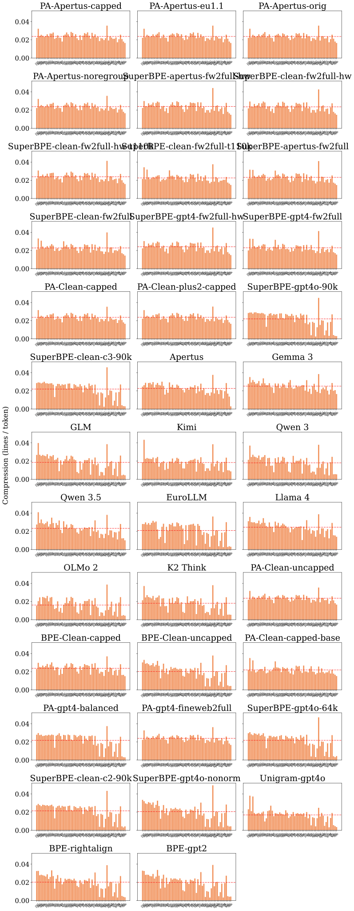

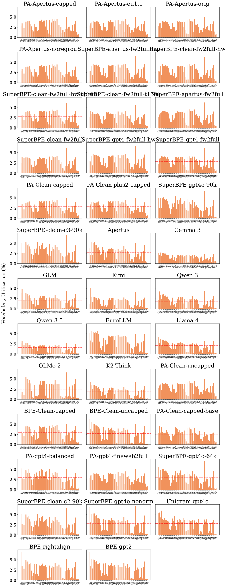

## Appendix: per-language plots by PA-BPE training family

One panel per linguistic family from the PA-BPE parity configs' family grouping (the same 22-family grouping as the shipped configs under `training/configs/`); each panel plots a metric per language within the family, with one line per tokenizer. Restricted to the 4 candidates, the Apertus baseline, and 5 open-source references. Plots are over the full FLORES devtest set (205 languages), filtered to families with at least 2 languages in that set.

**Compression rate (sent/tok, higher = better)**:

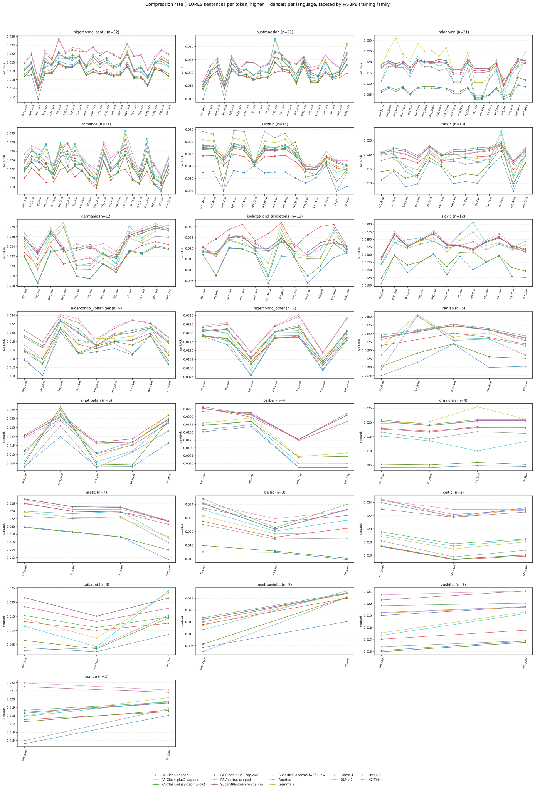

**Vocabulary utilization (fraction of vocab used, higher = more reuse)**:

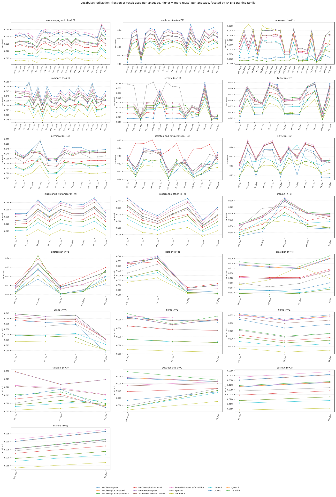

## Appendix: vocabulary usage (Active / Rare / Uncommon / Unseen, and Scaffold)

The four buckets (Active / Rare / Uncommon / Unseen) and the Scaffold overlay are defined in [REPORT_focus_candidates.md §3.1](REPORT_focus_candidates.md), which reports the four candidates, Apertus v1, and o200k. This is the full table across the design ablations, on the same corpus: a 49.2 MB FineWeb sample over the FLORES-200 language set (equal byte budget per language, 214,285 bytes, seed 0; FineWeb2 per language, English from FineWeb-1, which is where English lives) plus FineMath-4+ and StarCoder (Python and JavaScript). Hub-only reference tokenizers are omitted (no merge tree is exposed, so the buckets cannot be computed). Cross-tokenizer differences partly reflect how well this corpus matches each tokenizer's training data; Unseen is a small share here (about 3 to 6% at 131k) because the sample is web text spanning 210 languages, so most of each vocabulary is exercised at least once. All bucket percentages use the merge-token denominator; *Vocab util* (fraction of the full vocabulary emitted at least once) uses the full-vocabulary denominator.

<!-- BEGIN TABLE: vocab-usage-ablations -->
| Tokenizer | Vocab util ↑ | Active % | Rare % | Uncommon % | Unseen % | Scaffold % |
|---|---|---|---|---|---|---|
| Apertus-pretok + PA-BPE | 0.949 | 16.63 | 31.32 | 48.18 | 3.87 | 3.03 |
| CleanV1-pretok + PA-BPE (tuned data) | 0.948 | 15.84 | 30.32 | 49.88 | 3.95 | 3.13 |
| CleanV2-pretok + PA-BPE (tuned data) | 0.948 | 15.89 | 30.42 | 49.76 | 3.93 | 3.12 |
| CleanV3-pretok + PA-BPE (rebalanced data) | 0.952 | 16.22 | 31.59 | 48.52 | 3.68 | 2.91 |
| CleanV3-pretok + PA-BPE (base parity, rebalanced data) | 0.834 | 11.75 | 18.28 | 56.06 | 13.9 | 4.51 |
| Apertus-pretok + PA-BPE + SuperBPE | 0.958 | 21.57 | 43.52 | 31.3 | 3.61 | 2.04 |
| CleanV1-pretok + PA-BPE + SuperBPE | 0.966 | 18.64 | 42.06 | 36.53 | 2.77 | 2.25 |
| preliminary_mul_200k (CleanV2-pretok + PA-BPE, 200k) | 0.891 | 10.33 | 22.73 | 57.76 | 9.17 | 3.07 |
| preliminary_mul (CleanV3-pretok + PA-BPE, rebalanced) | 0.957 | 15.38 | 31.21 | 50.21 | 3.19 | 2.8 |
| preliminary_enh (CleanV2-pretok + PA-BPE, English-boosted) | 0.944 | 16.3 | 31.89 | 47.23 | 4.58 | 2.39 |
| preliminary_euh (CleanV2-pretok + PA-BPE, Fr/De-boosted) | 0.929 | 16.26 | 28.73 | 49.13 | 5.88 | 2.4 |
| SuperBPE(PA-base)·gpt4o·t90k | 0.913 | 13.18 | 27.03 | 52.9 | 6.89 | 3.54 |
| SuperBPE(PA-base)·clean-c3·t90k | 0.918 | 13.07 | 27.77 | 52.75 | 6.41 | 3.57 |
| PA-Clean-uncapped | 0.945 | 16.17 | 32.9 | 46.72 | 4.21 | 3.32 |
| BPE-Clean-capped | 0.974 | 16.43 | 35.54 | 46.06 | 1.97 | 2.15 |
| BPE-Clean-uncapped | 0.906 | 10.8 | 21.07 | 60 | 8.12 | 2.95 |
| PA-Clean-capped-base | 0.841 | 11.18 | 17.49 | 58.08 | 13.26 | 4.6 |
| PA-gpt4-balanced | 0.922 | 11.82 | 23.37 | 58.74 | 6.07 | 3.31 |
| PA-gpt4-fineweb2full | 0.947 | 17.46 | 33.25 | 45.26 | 4.03 | 3.16 |
| Apertus-pretok + PA-BPE (European ×1.1) | 0.946 | 16.84 | 32.23 | 46.79 | 4.14 | 3.13 |
| Apertus-pretok + PA-BPE (untuned data) | 0.946 | 16.93 | 33.35 | 45.65 | 4.07 | 3.18 |
| Apertus-pretok + PA-BPE (no semitic regroup) | 0.949 | 16.62 | 31.47 | 48.04 | 3.88 | 3.04 |
| SuperBPE(PA-base)·gpt4o·t64k | 0.936 | 13.2 | 28.87 | 52.85 | 5.09 | 3.01 |
| SuperBPE(PA-base)·clean-c2·t90k | 0.915 | 11.16 | 24.18 | 57.92 | 6.74 | 3.72 |
| SuperBPE(plain-base)·gpt4o·noNFC | 0.927 | 13.11 | 28.39 | 52.18 | 6.32 | 2.34 |
| BPE-rightalign | 0.887 | 12.02 | 24.17 | 53.7 | 10.11 | 2.65 |
| BPE-gpt2 | 0.877 | 11.09 | 22.02 | 55.96 | 10.92 | 2.92 |
| SuperBPE·clean-cap·hw·fw2full·t110k/130k | 0.958 | 17.86 | 37.38 | 41.48 | 3.28 | 2.67 |
| SuperBPE·clean-cap·base·fw2full·t110k/130k | 0.883 | 16.9 | 24.23 | 49.24 | 9.63 | 4.08 |
| SuperBPE·apertus-cap·base·fw2full | 0.918 | 20.39 | 31.88 | 41.08 | 6.64 | 3.36 |
| SuperBPE·clean-cap·base·fw2full | 0.916 | 18.06 | 30.85 | 44.34 | 6.75 | 3.57 |
| SuperBPE·gpt4·hw·fw2full | 0.959 | 22.24 | 44.24 | 29.94 | 3.57 | 2.01 |
| SuperBPE·gpt4·base·fw2full | 0.893 | 20.89 | 29.19 | 41.13 | 8.79 | 3.72 |
| BPE-gpt4o-balanced | 0.887 | 12.01 | 24.15 | 53.73 | 10.11 | 2.65 |
| BPE-gpt4o-balanced-NFC | 0.887 | 12.01 | 24.15 | 53.73 | 10.11 | 2.65 |
| PA-Clean-balanced-hw | 0.921 | 10.76 | 21.49 | 61.59 | 6.16 | 3.54 |
| BPE-Punct | 0.872 | 10.3 | 21.15 | 57.17 | 11.38 | 2.97 |
| SuperBPE on CleanV3-pretok (t110k/v130k) | 0.954 | 20.12 | 37.95 | 38.11 | 3.83 | 2.43 |
| CleanV3-pretok + plain BPE | 0.974 | 16.64 | 35.47 | 45.93 | 1.96 | 2.14 |
| SuperBPE-plus2-cv2-t110k | 0.955 | 20.1 | 38.11 | 38.15 | 3.64 | 2.43 |
| SuperBPE-plus2v2-cv2-t110k | 0.959 | 18 | 38.15 | 40.61 | 3.24 | 2.52 |
| PA-Clean-plus3-A8 | 0.962 | 16.03 | 33.89 | 47.17 | 2.91 | 2.63 |
| PA-Clean-plus3-A7 | 0.958 | 15.95 | 33.21 | 47.63 | 3.21 | 2.78 |
| PA-Clean-plus3-repcap8fr-cv2 | 0.951 | 15.79 | 31.15 | 49.33 | 3.73 | 2.92 |
| PA-Clean-plus3-repcap8fr-A8 | 0.962 | 16.02 | 33.85 | 47.24 | 2.89 | 2.63 |
| BPE-plus3-repcap8 | 0.967 | 16.3 | 34.54 | 46.58 | 2.58 | 2.17 |
<!-- END TABLE: vocab-usage-ablations -->

*Composition note: of Scaffold, the byte-fragment (incomplete-UTF-8 sub-character) share is 0.20 to 0.72 pp of vocab across the 46 tokenizers here; the rest are subword stepping-stones. Byte-fragments are not special-cased; they fall in Scaffold only when they behave like merge steps.*

*Scaffold examples (subword stepping-stones), CleanV1-pretok + PA-BPE + SuperBPE:* `ction`→` function` (built 17119×, final 97×); `्`→`म्` (built 10983×, final 40×); `ount`→`count` (built 6667×, final 116×); `----`→`-------` (built 6424×, final 63×); `ength`→`length` (built 5383×, final 51×)

*Scaffold examples (byte-fragments), CleanV1-pretok + PA-BPE:* `�`→`ा` (built 185699×, final 12×); ` �`→` к` (built 132453×, final 43×); `�`→`်` (built 76834×, final 85×); `�`→`া` (built 49691×, final 11×); ` �`→` �` (built 49068×, final 12×)

## Appendix: long-token (>64 char) examples

Examples truncated to 40 chars; entries that look blank are long runs of spaces. These flag decorative-junk tokens (e.g. `----`, `====`, space runs) vs legitimate long multibyte-script words.

- **CleanV2-pretok + PA-BPE (tuned data)** (8): `ລາຍການກະຈາຍສຽງຂອງວີໂອເອ`, `ၵၢၼ်ႁဵတ်းသၢင်ႈယၢမ်းလဵဝ်`, `ိူဝ်းသျိၼ်းဢၼ်ဢိတ်ႇဢွၵ်ႇလႆႈ`, `ဢဝ်ၼႃႈလိၵ်ႈသၢင်ႇထုၵ်ႇဝႃႈ`, ` ဢၼ်လွတ်ႈလႅဝ်းထၢင်ႇႁၢင်ႈ`, `ဝိူဝ်းသျိၼ်းဢၼ်ဢိတ်ႇဢွၵ်ႇလႆႈ`
- **Apertus-pretok + PA-BPE** (8): `ၵၢၼ်ႁဵတ်းသၢင်ႈယၢမ်းလဵဝ်`, `ဝႃးသျိၼ်းဢၼ်ၽိမ်းဢွၵ်ႇလႆႈ`, `ိူဝ်းသျိၼ်းဢၼ်ဢိတ်ႇဢွၵ်ႇလႆႈ`, `ລາຍການກະຈາຍສຽງຂອງວີໂອເອ`, ` ဢၼ်လွတ်ႈလႅဝ်းထၢင်ႇႁၢင်ႈ`, `လွင်ႈလႅၵ်ႈလၢႆႈမႂ်ႇမႂ်ႇ`
- **Apertus-pretok + PA-BPE (untuned data)** (8): `ဝႃးသျိၼ်းဢၼ်ၽိမ်းဢွၵ်ႇလႆႈ`, `ລາຍການກະຈາຍສຽງຂອງວີໂອເອ`, `ဢဝ်ၼႃႈလိၵ်ႈသၢင်ႇထုၵ်ႇဝႃႈ`, `ၵၢၼ်ႁဵတ်းသၢင်ႈယၢမ်းလဵဝ်`, `လွင်ႈလႅၵ်ႈလၢႆႈမႂ်ႇမႂ်ႇ`, `ဝိူဝ်းသျိၼ်းဢၼ်ဢိတ်ႇဢွၵ်ႇလႆႈ`
- **Apertus v1 (production)** (8): ` ***************************************`, `                                        `, `----------------------------------------`, `                                        `, `                                        `, `****************************************`
- **GLM** (119): `****************************************`, ` ---------------------------------------`, `                                        `, `//--------------------------------------`, `                                        `, ` *--------------------------------------`
- **Kimi** (90): ` //-------------------------------------`, `////////////////////////////////////////`, `                                        `, `/*--------------------------------------`, `//======================================`, `########################################`
- **Qwen 3** (116): `                                        `, `//--------------------------------------`, `########################################`, ` /**************************************`, `#---------------------------------------`, ` =======================================`
- **Qwen 3.5** (80): `                                        `, `########################################`, `//======================================`, `                                        `, `----------------------------------------`, ` ***************************************`
- **Llama 4** (68): `****************************************`, `****************************************`, `………………………………………………………………`, ` #######################################`, ` //-------------------------------------`, `........................................`
- **OLMo 2** (116): `/***************************************`, `////////////////////////////////////////`, ` =======================================`, `########################################`, ` |--------------------------------------`, ` ///////////////////////////////////////`
- **K2 Think** (116): `////////////////////////////////////////`, `                                        `, `                                        `, `//======================================`, `                                        `, ` ---------------------------------------`

### Junk-token examples

These are low-value vocab tokens that waste slots, in three categories (each token is counted once, in priority order punctuation, then web, then gibberish; examples truncated to 40 chars):
- **Punctuation**: runs of ≥8 punctuation/symbol/whitespace chars with no letters or digits (the *Junk toks* gate: decorative separators / whitespace runs).
- **Web/markup**: URL / HTML scrape residue: `://`, `www.…`, `.tld/path`, HTML entities (`&nbsp;`), self-closing/attributed tags (`/>`, `<a href=`, `class="…`). Strong markers only; bare `http`, `https`, `www`, `.com` and special/sentinel tokens (`<bos>`, `</s>`) are **not** flagged.
- **Gibberish**: hash / random-alphanumeric IDs: ASCII, ≥12 chars, a long hex run or many letter↔digit transitions (normal identifiers like `utf8`, `base64encoded`, `covid19` are **not** flagged).

**Punctuation runs:**
- **CleanV2-pretok + PA-BPE (tuned data)** (28): `;;;;;;;;`, `--------`, `================`, `////////`, `****************`, `-------------`
- **CleanV3-pretok + PA-BPE (rebalanced data)** (34): `##############`, `--------------`, `===============`, `________`, `-------------`, `-----------`
- **Apertus-pretok + PA-BPE** (27): `................`, `________________`, `********`, `----------------`, `------------`, `----------------`
- **Apertus-pretok + PA-BPE (untuned data)** (27): `////////////////`, `================`, `--------`, `________________`, `---------------`, `****************`
- **CleanV1-pretok + PA-BPE + SuperBPE** (77): `////////`, `***************`, `##############`, `))))))))`, `........`, `*********`
- **CleanV3-pretok + plain BPE** (46): `________`, `----------------`, `;;;;;;;;;;;;;;;;`, `================`, `////////////////`, `~~~~~~~~`
- **Apertus v1 (production)** (46): `============`, `****************************************`, `****************************************`, `================================`, `--------------------`, `}\\))\\({}_{`
- **Gemma 3** (150): `!!!!!!!!`, `.............`, `---------------`, `--------`, `~~~~~~~~~~~~~~~~`, `..............`
- **GLM** (334): `//--------------------------------------`, `~~~~~~~~~~~~~~~~~~~~~~~~~~~~~~~~`, `****************`, `********************`, `########################################`, `/***************************************`
- **Kimi** (273): `----------------------------------------`, `+---------------------------------------`, `----------------------------------------`, `========================================`, `;;;;;;;;;;;;;;;;`, `////////`
- **Qwen 3** (337): `+#+#+#+#+#+`, `/***************************************`, `+-+-+-+-+-+-+-+-`, `/***************************************`, `........`, `================`
- **Qwen 3.5** (245): `"../../../../`, `////////`, `/*======================================`, `'../../../../../`, `........................`, `................................`
- **EuroLLM** (14): `--------`, `////////`, `----------------`, `................`, `────────`, `________`
- **Llama 4** (293): `'../../../`, `"../../../`, `.________`, `-------------\n`, `******/\n`, `^^^^^^^^`
- **OLMo 2** (334): `========\n`, `---------------\n`, `//======================================`, `/*======================================`, `*******/\n`, `######################################`
- **K2 Think** (337): `/***************************************`, `****************************************`, `........................................`, `=======\n`, `________________________________`, `_______,`

**Web / markup residue:**
- **CleanV2-pretok + PA-BPE (tuned data)** (4): `/>`, `"/>`, `/>`, `://`
- **CleanV3-pretok + PA-BPE (rebalanced data)** (4): `"/>`, `://`, `/>`, `/>`
- **Apertus-pretok + PA-BPE** (4): `/>\n`, `"/>\n`, `://`, `/>\n`
- **Apertus-pretok + PA-BPE (untuned data)** (4): `/>\n`, `://`, `"/>\n`, `/>\n`
- **CleanV1-pretok + PA-BPE + SuperBPE** (10): `://`, `}"/>`, `/>`, `/></`, `'"/>`, `"/>`
- **CleanV3-pretok + plain BPE** (4): `/>`, `://`, `"/>`, `/>`
- **Apertus v1 (production)** (20): `/>;\n`, `/>`, `"/></`, `"/>\n\n`, `/><`, `://`
- **Gemma 3** (30): `/></`, `/>}`, `://$`, `)}/>`, `/>`, `://"`
- **GLM** (50): `/>\\`, `/>;\n`, `'/>\n`, `/>\r\n`, `/>\r\n`, `/>`
- **Kimi** (33): `</>\n`, `/>\n\n`, `://${`, `/>\r\n`, `/><`, `/>`
- **Qwen 3** (50): `/>\\`, `/>';\n`, `/></`, `/>.`, `"/>`, `/>\\`
- **Qwen 3.5** (25): `/>`, `/>`, `://"`, `/>\\`, `://`, `:///`
- **EuroLLM** (2): `://`, `/>`
- **Llama 4** (35): `"/>\n`, `/>}`, `/>);\n`, `/>`, `/>\n\n`, `/><`
- **OLMo 2** (50): `/>\n`, `/>`, `}/>\n`, `/>);\n`, `/>";\n`, `/>}`
- **K2 Think** (50): `://'`, `"/></`, `/>,`, `/>.\n`, `:///`, `/>\n`

**Hash / random-alphanumeric gibberish:**
- (none across the evaluated tokenizers)

### Dead / unreachable vocabulary examples (tokens that can never be emitted)

Dead vocab means entries that are unreachable under the faithful pipeline, either because the **normalizer** rewrites their surface or because the **pretokenizer** always splits their surface into ≥2 pre-tokens (within-pretoken merges can never build them). The pretokenizer case is skipped for SuperBPE-style tokenizers that merge across pretoken boundaries by design. Count shown is *normalizer-dead + pretokenizer-dead*.

- **Gemma 3** (5 normalizer): ` diffformul`, ` ::::::::`, ` yyyy`, ` YYYY`, ` `
- **Qwen 3** (248 normalizer): `טּ`, `露`, `劉`, `度`, `更`, `列`, `य़`, `לּ`
- **EuroLLM** (5370 normalizer): `akko`, `arms`, `ających`, `clusion`, `tedy`, `ab`, `andom`, `davo`
- **K2 Think** (248 normalizer): `量`, `鍊`, `〈`, `糖`, `殺`, `麟`, `שׂ`, ` của`
