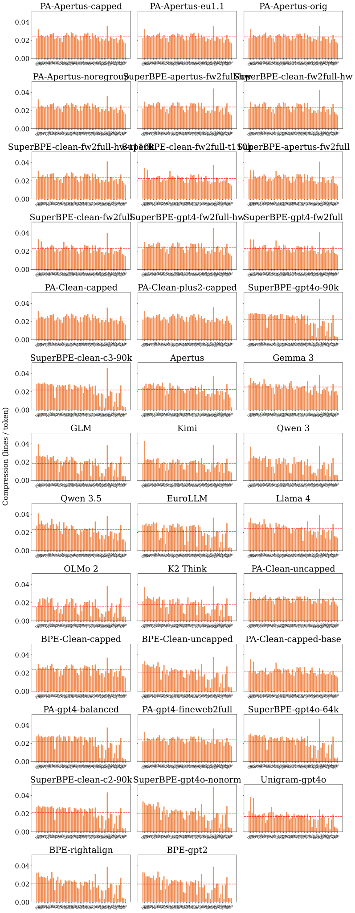
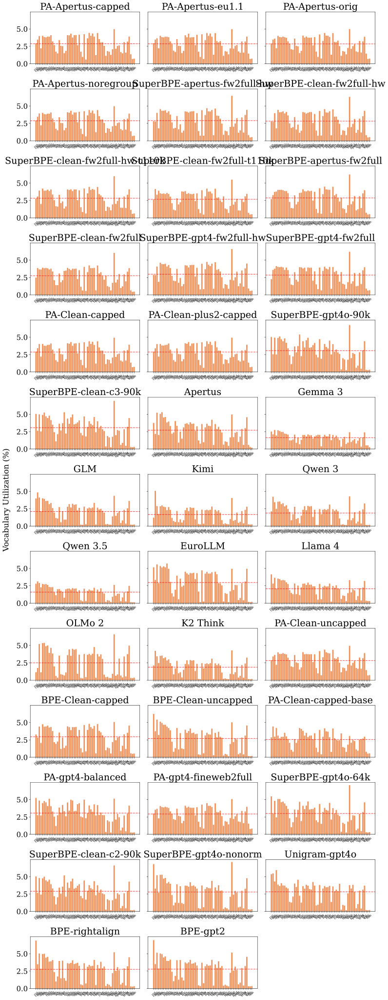
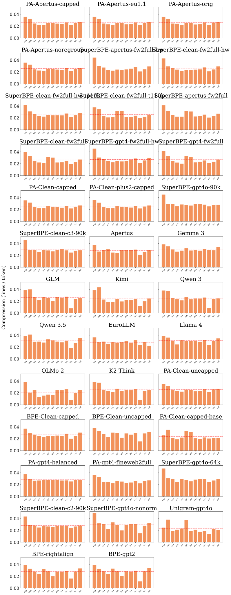
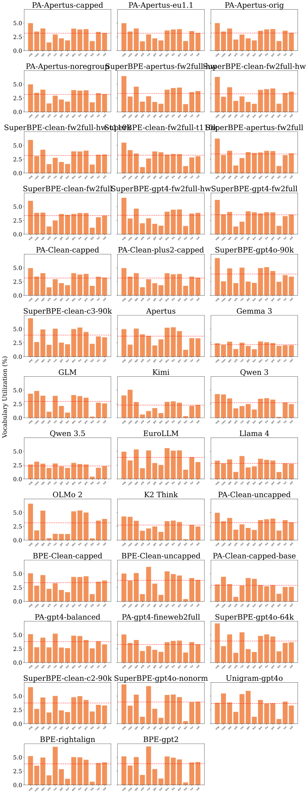

# Appendix: full intrinsic tables — companion to REPORT.md

*([← back to REPORT.md](REPORT.md))*

Full per-tokenizer × per-language intrinsic tables across the three FLORES evaluation sets (broad 60-language, core 13-language, full 205-language devtest), followed by per-language compression and vocabulary-utilization plots.

## Appendix — full intrinsic tables (all FLORES sets)

Every column of the candidate and reference intrinsic tables, per FLORES set. The body's *Candidates and references across FLORES sets* summarises the corpus-dependent metrics; these are the complete tables.

### broad — multilingual set across resource levels (FLORES dev split, 997 sent/lang) (60 languages, 59820 parallel sentences/tokenizer)

**Candidates** (Val/FLORES BPB are downstream-LM extrinsic metrics; `pending`/`—` where not yet run; see the ablations and the extrinsic appendix):

| Tokenizer | Vocab size | Special toks | Eng comp (B/tok) ↑ | Multiling. sent/tok ↑ | Vocab util ↑ | Vocab-util CoV ↓ | Avg langs/token ↑ | Gini ↓ | CER ↓ | Boundary-cross ↓ | Operator-isol ↑ | Enc ms/seq ↓ | Val BPB ↓ | FLORES BPB (tr.) ↓ |
|---|---|---|---|---|---|---|---|---|---|---|---|---|---|---|
| Apertus-pretok + PA-BPE | 127,835 | 4 | 4.336 | **0.0233** | 0.606 | **0.4130** | 2.79 | **0.081** | 0.00043 | 0.02208 | 0.502 | 0.088 | **0.729** | 1.170 |
| CleanV1-pretok + PA-BPE | 127,835 | 4 | 4.238 | 0.0232 | 0.605 | 0.4138 | 2.79 | **0.081** | 0.00043 | **0.02198** | **0.987** | 0.110 | **0.729** | 1.169 |
| CleanV2-pretok + PA-BPE | 127,835 | 4 | 4.260 | **0.0233** | 0.607 | 0.4132 | 2.79 | **0.081** | 0.00043 | 0.02200 | **0.987** | 0.107 | **0.729** | 1.171 |
| CleanV3-pretok + PA-BPE (rebalanced data) | 127,835 | 4 | 4.261 | **0.0233** | **0.625** | 0.4212 | 2.74 | 0.087 | 0.00043 | 0.02699 | **0.987** | **0.064** | **0.729** | 1.170 |
| CleanV3-pretok + PA-BPE (base parity, rebalanced data) | 127,835 | 4 | 3.177 | 0.0217 | 0.559 | 0.4352 | 2.79 | 0.095 | 0.00043 | 0.02810 | 0.986 | 0.067 | — | — |
| Apertus-pretok + PA-BPE + SuperBPE | 128,000 | 0 | **5.402** | 0.0230 | 0.544 | 0.4992 | **3.14** | 0.110 | 0.00043 | 0.02686 | 0.466 | 0.079 | 0.733 | 1.176 |
| CleanV1-pretok + PA-BPE + SuperBPE | 128,000 | 0 | 5.013 | 0.0227 | 0.550 | 0.4892 | 3.02 | 0.106 | 0.00043 | 0.02629 | **0.987** | 0.071 | 0.732 | **1.161** |

**Open-source references:**

| Tokenizer | Vocab size | Special toks | Eng comp (B/tok) ↑ | Multiling. sent/tok ↑ | Vocab util ↑ | Vocab-util CoV ↓ | Avg langs/token ↑ | Gini ↓ | CER ↓ | Boundary-cross ↓ | Operator-isol ↑ | Enc ms/seq ↓ |
|---|---|---|---|---|---|---|---|---|---|---|---|---|
| Apertus v1 (production) | 131,072 | 1,000 | 4.595 | 0.0198 | 0.561 | 0.5133 | 2.86 | 0.205 | **0.00000** | 0.02010 | 0.486 | 0.177 |
| Gemma 3 | 262,145 | 6,415 | 4.636 | **0.0244** | 0.430 | **0.3919** | 2.35 | **0.106** | **0.00000** | 0.03414 | **0.929** | 0.118 |
| GLM | 151,343 | 14 | 4.726 | 0.0126 | 0.347 | 0.6230 | 3.55 | 0.379 | **0.00000** | 0.06151 | 0.576 | 0.160 |
| Kimi | 163,601 | 17 | 4.726 | 0.0163 | 0.225 | 0.6648 | 4.34 | 0.199 | **0.00000** | 0.03995 | 0.533 | **0.098** |
| Qwen 3 | 151,669 | 26 | 4.623 | 0.0136 | 0.314 | 0.6222 | 3.50 | 0.320 | 0.00043 | 0.06152 | 0.577 | 0.188 |
| Qwen 3.5 | 248,077 | 33 | 4.573 | 0.0211 | 0.379 | 0.5427 | 2.47 | 0.180 | 0.00043 | **0.00361** | 0.576 | 0.112 |
| EuroLLM | 128,000 | 261 | 4.321 | 0.0121 | **0.665** | 0.5977 | 2.71 | 0.459 | **0.00000** | 0.01720 | 0.023 | 0.152 |
| Llama 4 | 201,135 | 1,135 | **4.776** | 0.0228 | 0.480 | 0.4915 | 2.56 | 0.153 | **0.00000** | 0.03312 | 0.433 | **0.098** |
| OLMo 2 | 100,278 | 22 | 4.732 | 0.0114 | 0.277 | 0.7487 | **5.26** | 0.353 | **0.00000** | 0.05851 | 0.577 | 0.211 |
| K2 Think | 151,665 | 22 | 4.623 | 0.0136 | 0.314 | 0.6222 | 3.50 | 0.320 | 0.00043 | 0.06152 | 0.577 | 0.219 |

### core — high-resource core (FLORES dev split, 997 sent/lang) (31 languages, 14761 parallel sentences/tokenizer)

**Candidates:**

| Tokenizer | Vocab size | Special toks | Eng comp (B/tok) ↑ | Multiling. sent/tok ↑ | Vocab util ↑ | Vocab-util CoV ↓ | Avg langs/token ↑ | Gini ↓ | CER ↓ | Boundary-cross ↓ | Operator-isol ↑ | Enc ms/seq ↓ |
|---|---|---|---|---|---|---|---|---|---|---|---|---|
| Apertus-pretok + PA-BPE | 127,835 | 4 | 4.336 | 0.0252 | 0.252 | 0.3348 | **1.60** | 0.068 | 0.00015 | 0.00253 | 0.435 | 0.081 |
| CleanV1-pretok + PA-BPE | 127,835 | 4 | 4.238 | 0.0251 | 0.252 | 0.3345 | **1.60** | 0.067 | 0.00015 | 0.00245 | **0.991** | 0.070 |
| CleanV2-pretok + PA-BPE | 127,835 | 4 | 4.260 | 0.0252 | 0.252 | 0.3344 | **1.60** | **0.066** | 0.00015 | 0.00248 | **0.991** | 0.069 |
| CleanV3-pretok + PA-BPE (rebalanced data) | 127,835 | 4 | 4.261 | 0.0255 | 0.263 | 0.3346 | 1.57 | **0.066** | 0.00015 | 0.00249 | **0.991** | **0.060** |
| CleanV3-pretok + PA-BPE (base parity, rebalanced data) | 127,835 | 4 | 3.177 | 0.0235 | 0.240 | **0.3304** | **1.60** | 0.092 | 0.00015 | **0.00054** | **0.991** | 0.061 |
| Apertus-pretok + PA-BPE + SuperBPE | 128,000 | 0 | **5.402** | **0.0259** | **0.266** | 0.4479 | **1.60** | 0.085 | 0.00015 | 0.00412 | 0.407 | 0.065 |
| CleanV1-pretok + PA-BPE + SuperBPE | 128,000 | 0 | 5.013 | 0.0255 | **0.266** | 0.4334 | 1.57 | 0.080 | 0.00015 | 0.00377 | 0.990 | 0.081 |

**Open-source references:**

| Tokenizer | Vocab size | Special toks | Eng comp (B/tok) ↑ | Multiling. sent/tok ↑ | Vocab util ↑ | Vocab-util CoV ↓ | Avg langs/token ↑ | Gini ↓ | CER ↓ | Boundary-cross ↓ | Operator-isol ↑ | Enc ms/seq ↓ |
|---|---|---|---|---|---|---|---|---|---|---|---|---|
| Apertus v1 (production) | 131,072 | 1,000 | 4.595 | 0.0275 | 0.344 | 0.3587 | 1.39 | 0.071 | **0.00000** | 0.00146 | 0.373 | 0.100 |
| Gemma 3 | 262,145 | 6,415 | 4.636 | **0.0302** | 0.222 | **0.2110** | 1.30 | **0.055** | **0.00000** | 0.04391 | **0.836** | **0.053** |
| GLM | 151,343 | 14 | 4.726 | 0.0225 | 0.251 | 0.4998 | 1.52 | 0.206 | **0.00000** | 0.05280 | 0.526 | 0.107 |
| Kimi | 163,601 | 17 | 4.726 | 0.0217 | 0.173 | 0.5984 | 1.70 | 0.153 | **0.00000** | 0.01076 | 0.489 | 0.069 |
| Qwen 3 | 151,669 | 26 | 4.623 | 0.0223 | 0.228 | 0.4279 | 1.53 | 0.181 | 0.00015 | 0.05127 | 0.527 | 0.129 |
| Qwen 3.5 | 248,077 | 33 | 4.573 | 0.0295 | 0.234 | 0.2920 | 1.30 | 0.099 | 0.00015 | **0.00090** | 0.527 | 0.081 |
| EuroLLM | 128,000 | 261 | 4.321 | 0.0276 | **0.363** | 0.3579 | 1.40 | 0.066 | **0.00000** | 0.04062 | 0.623 | 0.100 |
| Llama 4 | 201,135 | 1,135 | **4.776** | **0.0302** | 0.273 | 0.3158 | 1.34 | 0.071 | **0.00000** | 0.00115 | 0.328 | 0.076 |
| OLMo 2 | 100,278 | 22 | 4.732 | 0.0183 | 0.206 | 0.7117 | **1.94** | 0.215 | **0.00000** | 0.05032 | 0.527 | 0.139 |
| K2 Think | 151,665 | 22 | 4.623 | 0.0223 | 0.228 | 0.4279 | 1.53 | 0.181 | 0.00015 | 0.05127 | 0.527 | 0.083 |

### full — all available FLORES+ languages (devtest split, 1012 sent/lang) (205 languages, 207459 parallel sentences/tokenizer)

**Candidates:**

| Tokenizer | Vocab size | Special toks | Eng comp (B/tok) ↑ | Multiling. sent/tok ↑ | Vocab util ↑ | Vocab-util CoV ↓ | Avg langs/token ↑ | Gini ↓ | CER ↓ | Boundary-cross ↓ | Operator-isol ↑ | Enc ms/seq ↓ |
|---|---|---|---|---|---|---|---|---|---|---|---|---|
| Apertus-pretok + PA-BPE | 127,835 | 4 | 4.336 | 0.0203 | 0.851 | **0.3959** | 6.15 | **0.093** | 0.00133 | 0.01229 | 0.441 | 0.094 |
| CleanV1-pretok + PA-BPE | 127,835 | 4 | 4.238 | 0.0201 | 0.853 | 0.3976 | 6.11 | 0.098 | 0.00133 | **0.01194** | 0.993 | 0.123 |
| CleanV2-pretok + PA-BPE | 127,835 | 4 | 4.260 | 0.0203 | **0.854** | 0.3965 | 6.12 | **0.093** | 0.00133 | 0.01223 | 0.993 | 0.108 |
| CleanV3-pretok + PA-BPE (rebalanced data) | 127,835 | 4 | 4.261 | 0.0204 | 0.849 | 0.4001 | 6.21 | 0.098 | 0.00133 | 0.01379 | 0.993 | **0.074** |
| CleanV3-pretok + PA-BPE (base parity, rebalanced data) | 127,835 | 4 | 3.177 | 0.0186 | 0.776 | 0.4328 | 5.98 | 0.107 | 0.00133 | 0.01548 | **0.994** | **0.074** |
| Apertus-pretok + PA-BPE + SuperBPE | 128,000 | 0 | **5.402** | **0.0212** | 0.757 | 0.4412 | **7.51** | 0.102 | 0.00133 | 0.01407 | 0.406 | 0.084 |
| CleanV1-pretok + PA-BPE + SuperBPE | 128,000 | 0 | 5.013 | 0.0208 | 0.776 | 0.4304 | 7.06 | 0.103 | 0.00133 | 0.01329 | 0.991 | 0.091 |

**Open-source references:**

| Tokenizer | Vocab size | Special toks | Eng comp (B/tok) ↑ | Multiling. sent/tok ↑ | Vocab util ↑ | Vocab-util CoV ↓ | Avg langs/token ↑ | Gini ↓ | CER ↓ | Boundary-cross ↓ | Operator-isol ↑ | Enc ms/seq ↓ |
|---|---|---|---|---|---|---|---|---|---|---|---|---|
| Apertus v1 (production) | 131,072 | 1,000 | 4.595 | 0.0142 | 0.648 | 0.4817 | 7.73 | 0.313 | **0.00000** | 0.01865 | 0.472 | 0.179 |
| Gemma 3 | 262,145 | 6,415 | 4.636 | **0.0193** | 0.520 | **0.4103** | 5.89 | **0.150** | **0.00000** | 0.02140 | 0.475 | **0.119** |
| GLM | 151,343 | 14 | 4.726 | 0.0116 | 0.405 | 0.5601 | 9.53 | 0.354 | **0.00000** | 0.04893 | **0.508** | 0.120 |
| Kimi | 163,601 | 17 | 4.726 | 0.0144 | 0.275 | 0.5752 | 11.81 | 0.213 | **0.00000** | 0.03450 | 0.480 | 0.163 |
| Qwen 3 | 151,669 | 26 | 4.623 | 0.0131 | 0.373 | 0.5518 | 9.55 | 0.280 | 0.00133 | 0.05114 | **0.508** | 0.202 |
| Qwen 3.5 | 248,077 | 33 | 4.573 | 0.0160 | 0.445 | 0.5156 | 6.29 | 0.242 | 0.00133 | 0.01280 | 0.507 | 0.138 |
| EuroLLM | 128,000 | 261 | 4.321 | 0.0116 | **0.758** | 0.5521 | 7.01 | 0.402 | **0.00000** | **0.01205** | 0.026 | 0.157 |
| Llama 4 | 201,135 | 1,135 | **4.776** | 0.0172 | 0.559 | 0.4766 | 6.48 | 0.221 | **0.00000** | 0.03413 | 0.428 | 0.160 |
| OLMo 2 | 100,278 | 22 | 4.732 | 0.0109 | 0.342 | 0.6505 | **14.61** | 0.339 | **0.00000** | 0.04732 | **0.508** | 0.231 |
| K2 Think | 151,665 | 22 | 4.623 | 0.0131 | 0.373 | 0.5518 | 9.55 | 0.280 | 0.00133 | 0.05114 | **0.508** | 0.166 |

## Appendix — per-language plots (compression & vocabulary utilization)

Small multiples, one panel per language.

**broad** — compression & vocabulary utilization:

**core** — compression & vocabulary utilization:

